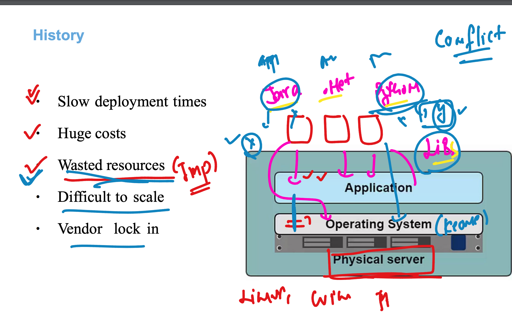
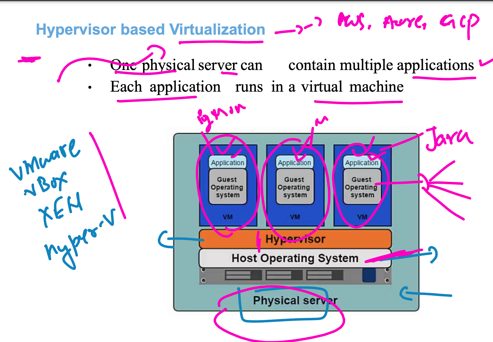
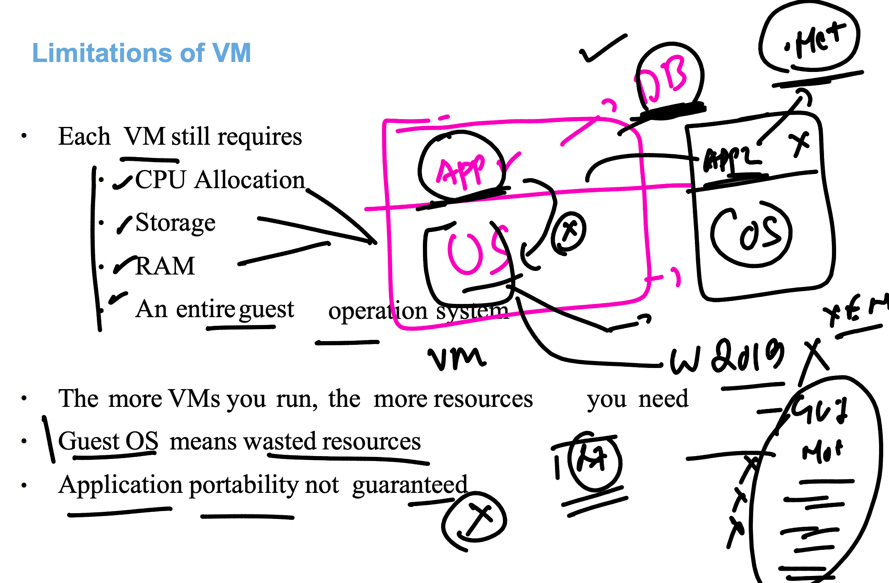
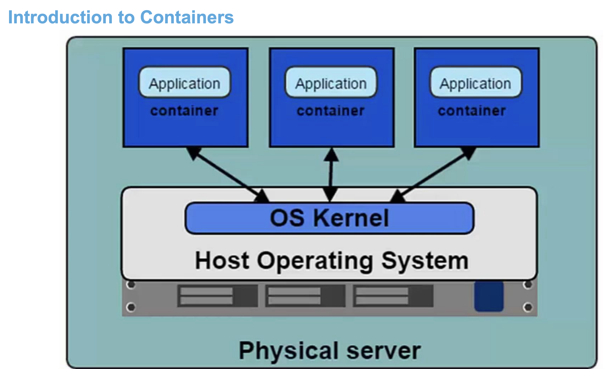
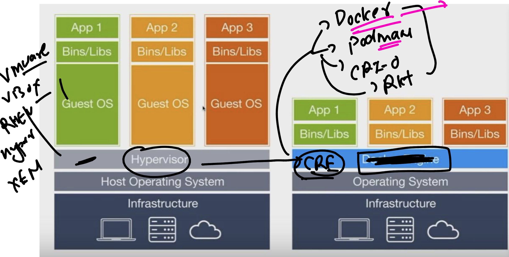

## Basic Discussion 

### Physical machine to Virutal machine (using Hypervisor tech)

### COntainer base line understanding -- problem with VM model 

### Container intro 

### Managing containers life cycle using CRE (container runtime engines)

