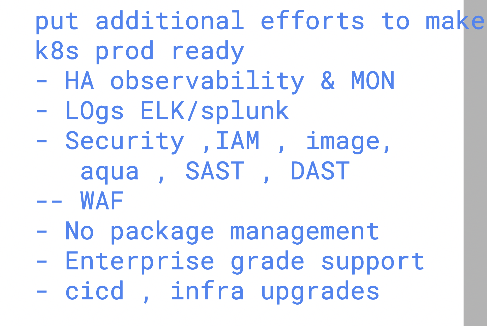

# Revision 
## APp containers revision 


### k8s Revision 


## k8s to OCP 



## OPenshift basic Architecture understanding 


## Connecting openshift cluster from client machine 


## OPenshift community edition 

[click](https://okd.io/docs/documentation/)

## setup openshift in PC  (CRC)

[click](https://www.redhat.com/en/blog/codeready-containers)

### OPenshift container platform user basic details 


### loging to OC cluster from cli 


### NS vs projects 


### checking project 

```
PS C:\Users\labuser> oc projects
You have access to the following projects and can switch between them with ' project <projectname>':

  * default
    kube-node-lease
    kube-public
    kube-system
    openshift
    openshift-apiserver
```

### Creating pod in OCP cluster with default project 


