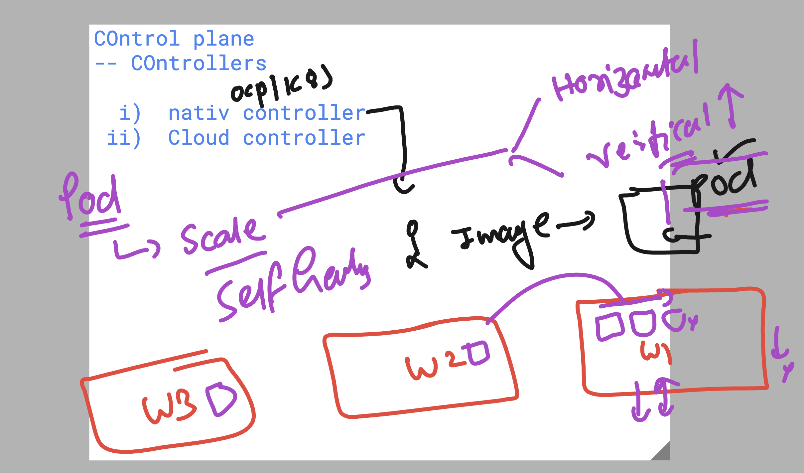
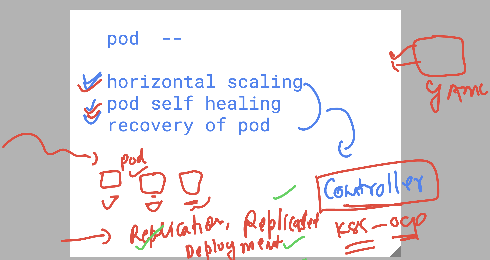
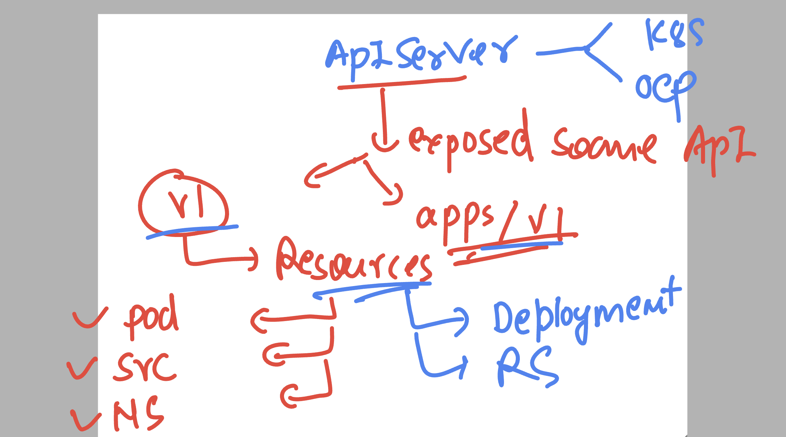
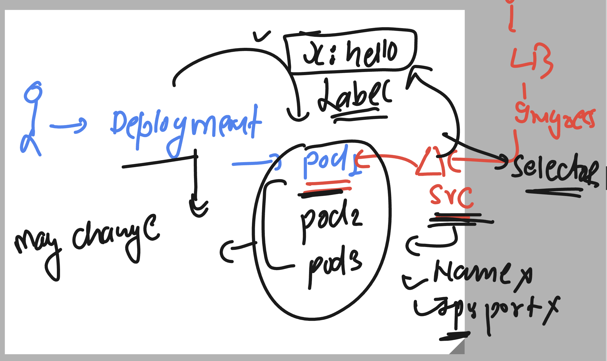

## POd problems 



## openshift , k8s  native controller 

- Replication controller --> Replicaset --> Deployment controller 



### switching back to k8s cluster 

```
PS C:\Users\labuser\Desktop\ashu-project> kubectl.exe config use-context  fiserv-cluster1
Switched to context "fiserv-cluster1".
PS C:\Users\labuser\Desktop\ashu-project> kubectl.exe get nodes
NAME                                STATUS   ROLES    AGE   VERSION 
aks-agentpool-33643096-vmss000002   Ready    <none>   9d    v1.30.10
aks-usernodes-33643096-vmss00000a   Ready    <none>   9d    v1.30.10
aks-usernodes-33643096-vmss00000b   Ready    <none>   9d    v1.30.10
aks-usernodes-33643096-vmss00000c   Ready    <none>   9d    v1.30.10
aks-usernodes-33643096-vmss00000d   Ready    <none>   9d    v1.30.10
aks-usernodes-33643096-vmss00000e   Ready    <none>   9d    v1.30.10
PS C:\Users\labuser\Desktop\ashu-project> kubectl.exe  config get-contexts 
CURRENT   NAME                                                         CLUSTER                                   AUTHINFO                                             NAMESPACE
          default/api-cluster-synergificsoftware-com:6443/kube:admin   api-cluster-synergificsoftware-com:6443   kube:admin/api-cluster-synergificsoftware-com:6443   default
          docker-desktop                                               docker-desktop                            docker-desktop
*         fiserv-cluster1                                              fiserv-cluster1                           clusterUser_fiserv-aks_fiserv-cluster1               ashu-project
PS C:\Users\labuser\Desktop\ashu-project> kubectl get pods         
No resources found in ashu-project namespace.
PS C:\Users\labuser\Desktop\ashu-project> kubectl get pods,svc 

```


### Creating pod using deployment controller 

### creating deployment controller yaml manifest file 

```
kubectl  create  deployment  ashu-deploy  --image docker.io/dockerashu/ashufsrv:appv2  --dry-run=client  -o yaml >deploy1.yaml
```

### Understanding api Resources 



### 

```
PS C:\Users\labuser\Desktop\ashu-project\ashu-app-deploy> kubectl create  -f .\deploy1.yaml
deployment.apps/ashu-deploy created
PS C:\Users\labuser\Desktop\ashu-project\ashu-app-deploy> kubectl.exe  get deployment 
NAME          READY   UP-TO-DATE   AVAILABLE   AGE        
ashu-deploy   1/1     1            1           16s        
PS C:\Users\labuser\Desktop\ashu-project\ashu-app-deploy> kubectl.exe  get  pods
NAME                           READY   STATUS    RESTARTS   AGE
ashu-deploy-64d8fd7fdf-wsnk9   1/1     Running   0          37s

```
### changing replica number of pod and do apply 

```
PS C:\Users\labuser\Desktop\ashu-project\ashu-app-deploy> kubectl.exe create -f .\deploy1.yaml
Error from server (AlreadyExists): error when creating ".\\deploy1.yaml": deployments.apps "ashu-deploy" already exists
PS C:\Users\labuser\Desktop\ashu-project\ashu-app-deploy>
PS C:\Users\labuser\Desktop\ashu-project\ashu-app-deploy>
PS C:\Users\labuser\Desktop\ashu-project\ashu-app-deploy>
PS C:\Users\labuser\Desktop\ashu-project\ashu-app-deploy> kubectl.exe apply  -f .\deploy1.yaml
Warning: resource deployments/ashu-deploy is missing the kubectl.kubernetes.io/last-applied-configuration annotation which is required by kubectl apply. kubectl apply should only be used on resources created declaratively by either kubectl create --save-config or kubectl apply. The missing annotation will be patched automatically.
deployment.apps/ashu-deploy configured
PS C:\Users\labuser\Desktop\ashu-project\ashu-app-deploy> kubectl.exe  get  pods
NAME                           READY   STATUS    RESTARTS   AGE
ashu-deploy-64d8fd7fdf-8m8z8   1/1     Running   0          7s
ashu-deploy-64d8fd7fdf-fj65h   1/1     Running   0          4m8s
PS C:\Users\labuser\Desktop\ashu-project\ashu-app-deploy> kubectl.exe  get  pods -o wide
NAME                           READY   STATUS    RESTARTS   AGE     IP             NODE                                NOMINATED NODE   READINESS GATES
ashu-deploy-64d8fd7fdf-8m8z8   1/1     Running   0          15s     10.244.3.92    aks-usernodes-33643096-vmss00000e   <none>           <none>
ashu-deploy-64d8fd7fdf-fj65h   1/1     Running   0          4m16s   10.244.2.240   aks-usernodes-33643096-vmss00000d   <none>           <none>
PS C:\Users\labuser\Desktop\ashu-project\ashu-app-deploy>

```

### scaling up or down pods with yaml change 

```
PS C:\Users\labuser\Desktop\ashu-project\ashu-app-deploy> kubectl.exe  get  deploy
NAME          READY   UP-TO-DATE   AVAILABLE   AGE        
ashu-deploy   0/0     0            0           18m        
PS C:\Users\labuser\Desktop\ashu-project\ashu-app-deploy> 
PS C:\Users\labuser\Desktop\ashu-project\ashu-app-deploy> 
PS C:\Users\labuser\Desktop\ashu-project\ashu-app-deploy> kubectl scale deployment  ashu-deploy --replicas 3
deployment.apps/ashu-deploy scaled
PS C:\Users\labuser\Desktop\ashu-project\ashu-app-deploy> kubectl.exe  get  deploy
NAME          READY   UP-TO-DATE   AVAILABLE   AGE        
ashu-deploy   3/3     3            3           18m        
PS C:\Users\labuser\Desktop\ashu-project\ashu-app-deploy> kubectl.exe  get  pods
NAME                           READY   STATUS    RESTARTS   AGE
ashu-deploy-64d8fd7fdf-7j8w2   1/1     Running   0          9s 
ashu-deploy-64d8fd7fdf-dc5hm   1/1     Running   0          9s 
ashu-deploy-64d8fd7fdf-wdvbr   1/1     Running   0          9s 
PS C:\Users\labuser\Desktop\ashu-project\ashu-app-deploy>      

```

## service finding pods by using pod label 



### checking it 

```
 59 kubectl scale deployment  ashu-deploy --replicas 2
  60 kubectl.exe  get po  --show-labels
  61 kubectl.exe  get pod -o wide
  62 kubectl.exe  get deploy
  63 kubectl.exe  expose deploy ashu-deploy --type ClusterIP --port 80 --name lb1 --dry-run=client  -o yaml
  64 kubectl.exe  get po  --show-labels
  65 kubectl.exe  expose deploy ashu-deploy --type ClusterIP --port 80 --name lb1 --dry-run=client  -o yaml     >svc4.yaml
  66 kubectl.exe create -f .\svc4.yaml
  67 kubectl.exe get svc
  68 kubectl.exe  get  ep

```
