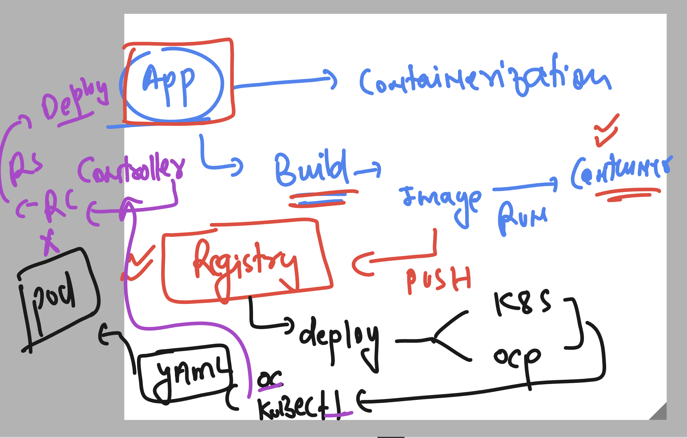
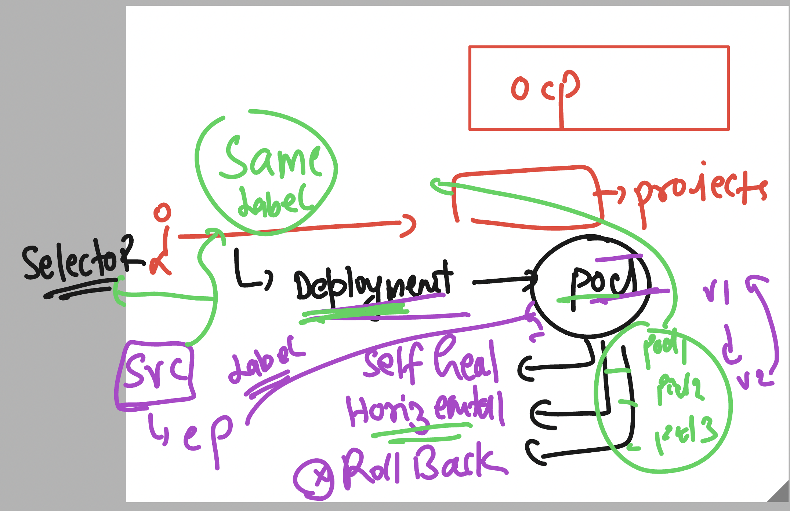

## Reconnect to openshift / k8s controllers to create PODs 



## Deployment controller 



### Login to OCP cluster 

```bash

PS C:\Users\labuser> oc login -u kubeadmin -p 8LFWx-u6r5Q-Q9FeZ-yg6ef https://api.hm9pf1p6kad6e4221e.eastus.aroapp.io:6443
Login successful.

You have access to 72 projects, the list has been suppressed. You can list all projects with 'oc projects'

Using project "default".
PS C:\Users\labuser> oc  get nodes
NAME                                        STATUS   ROLES                  AGE   VERSION
fiserv-cluster-9dkff-master-0               Ready    control-plane,master   25h   v1.29.10+67d3387
fiserv-cluster-9dkff-master-1               Ready    control-plane,master   25h   v1.29.10+67d3387
fiserv-cluster-9dkff-master-2               Ready    control-plane,master   25h   v1.29.10+67d3387
fiserv-cluster-9dkff-worker-eastus1-rwvz2   Ready    worker                 25h   v1.29.10+67d3387
fiserv-cluster-9dkff-worker-eastus2-rfppk   Ready    worker                 25h   v1.29.10+67d3387
fiserv-cluster-9dkff-worker-eastus3-cnwzm   Ready    worker                 25h   v1.29.10+67d3387
PS C:\Users\labuser> oc project
Using project "default" on server "https://api.hm9pf1p6kad6e4221e.eastus.aroapp.io:6443".
PS C:\Users\labuser> oc projects
You have access to the following projects and can switch between them with ' project <projectname>':

  * default
    kube-node-lease
    kube-public
```

### Creating deployment yaml using oc 

```bash
oc create  deployment  ashu-dep1  --image docker.io/dockerashu/ashufsrv:appv2 --dry-run=client -o yaml  >deploy1.yaml

===>
oc create -f deploy1.yaml 
```

### access to pod container 

```
PS C:\Users\labuser> oc  exec -it ashu-deploy-6dcfbdf5d4-268j7 -- /bin/sh
sh-4.4#
sh-4.4#
sh-4.4# cd /var/www/html/
sh-4.4# ls
images  index.html  styles
sh-4.4# exit
exit
```
