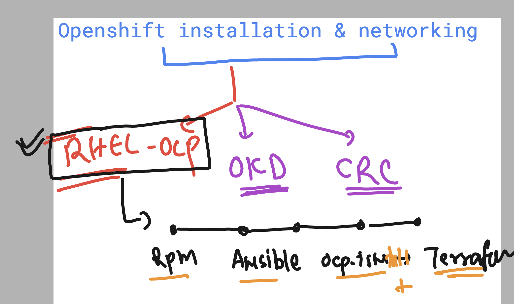
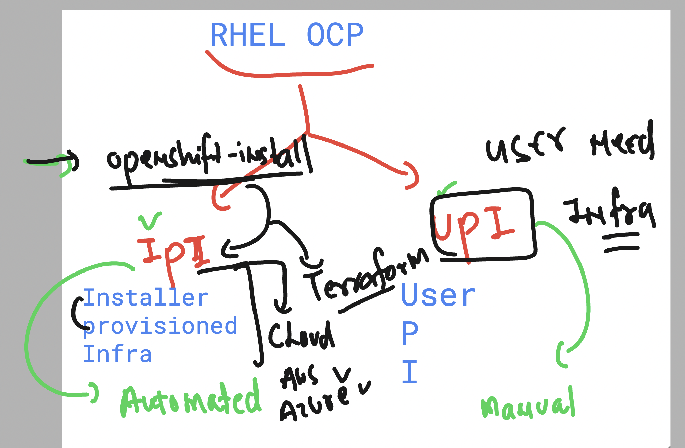
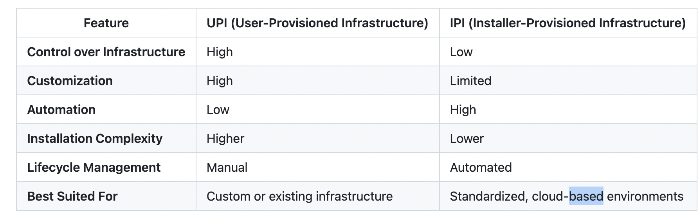
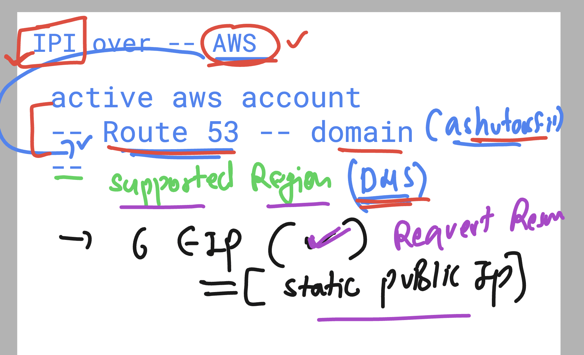
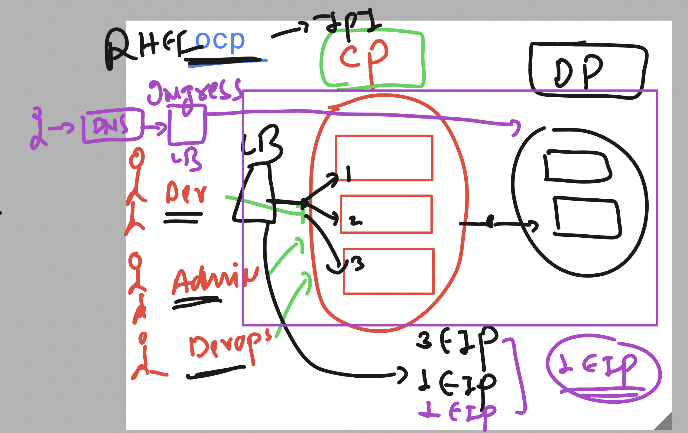
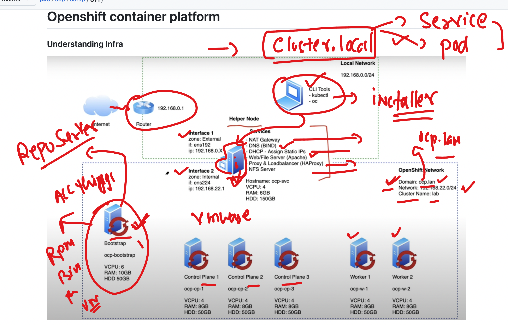
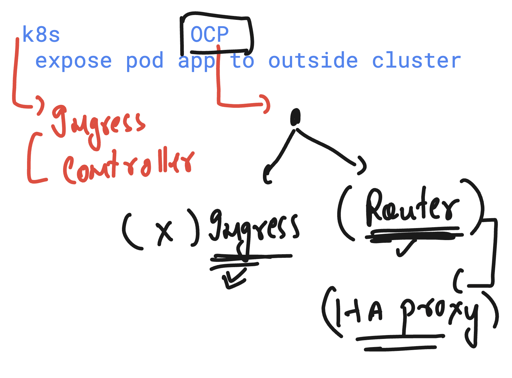
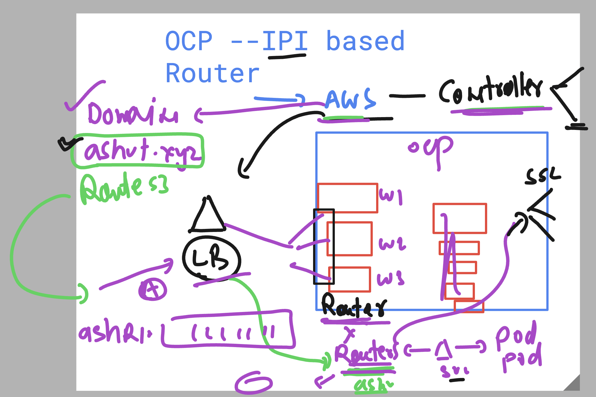

# Openshift Installation Understanding 

## Currently RHEL OCP 

### UPI vs IPI 

### Things we need to have in AWS account Infra 

### Minimum ocp with aws / other cloud platform need 

## UPI setup understanding 

### To expose any pod app outside cluster 

### OCP Routes 

