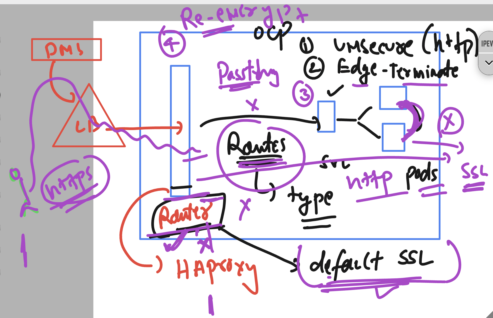

# Openshift Installation Understanding 


## Currently RHEL OCP 


### UPI vs IPI 


### Things we need to have in AWS account Infra 


### Minimum ocp with aws / other cloud platform need 


## UPI setup understanding 


### To expose any pod app outside cluster 


### OCP Routes 


## Steps to deploy webapp and access from external world 

```
===Deployment to create pods 


PS C:\Users\labuser\Desktop\ashu-project\demo-app> oc apply -f .\app_deploy.yaml
deployment.apps/ashu-web created
PS C:\Users\labuser\Desktop\ashu-project\demo-app> oc  get  deploy
NAME        READY   UP-TO-DATE   AVAILABLE   AGE
amit-web    2/2     2            2           4m18s
ashu-web    2/2     2            2           18s
jh-web      2/2     2            2           8s
manoj-web   1/2     2            1           2s

====> creating service 

 oc  expose deployment  ashu-web --type ClusterIP --port 80 --target-port 8080 --name ashu-lb1 --dry-run=client -o yaml >ashu_svc.yaml 

 ===>
 PS C:\Users\labuser\Desktop\ashu-project\demo-app> oc  get svc
NAME         TYPE           CLUSTER-IP       EXTERNAL-IP                            PORT(S)   AGE
amit-lb1     ClusterIP      172.30.114.213   <none>                                 80/TCP    2m46s
ashu-lb1     ClusterIP      172.30.151.185   <none>                                 80/TCP    3m2s
bhanu-lb1    ClusterIP      172.30.118.1     <none>                                 80/TCP    106s
jh-lb1       ClusterIP      172.30.184.231   <none>                                 80/TCP    2m21s
krish-lb1    ClusterIP      172.30.233.46    <none>     

```

## Routes options in OCP 



### creating default routes of unsecure type 

```
PS C:\Users\labuser\Desktop\ashu-project\demo-app> oc  expose  service  ashu-lb1  --dry-run=client -o yaml
apiVersion: route.openshift.io/v1
kind: Route
metadata:
  creationTimestamp: null        
  labels:
    app: ashu-web
  name: ashu-lb1
spec:
  port:
    targetPort: 8080
  to:
    kind: ""
    name: ashu-lb1
    weight: null
status: {}
PS C:\Users\labuser\Desktop\ashu-project\demo-app> oc  expose  service  ashu-lb1  --dry-run=client -o yaml  >ashu_route.yaml
PS C:\Users\labuser\Desktop\ashu-project\demo-app> oc create  -f .\ashu_route.yaml
route.route.openshift.io/ashu-lb1 created
PS C:\Users\labuser\Desktop\ashu-project\demo-app> oc  get  route
NAME       HOST/PORT                                                   PATH   SERVICES   PORT   TERMINATION   WILDCARD
ashu-lb1   ashu-lb1-default.apps.hm9pf1p6kad6e4221e.eastus.aroapp.io          ashu-lb1   8080                 None    
ashu-lb2   ashu-lb2-default.apps.hm9pf1p6kad6e4221e.eastus.aroapp.io          ashu-lb2   80                   None    
jh-lb1     jh-lb1-default.apps.hm9pf1p6kad6e4221e.eastus.aroapp.io            jh-lb1     8080                 None    
rayu-lb1   rayu-lb1-default.apps.hm9pf1p6kad6e4221e.eastus.aroapp.io          rayu-lb1   8080                 None    
PS C:\Users\labuser\Desktop\ashu-project\demo-app> 


```
