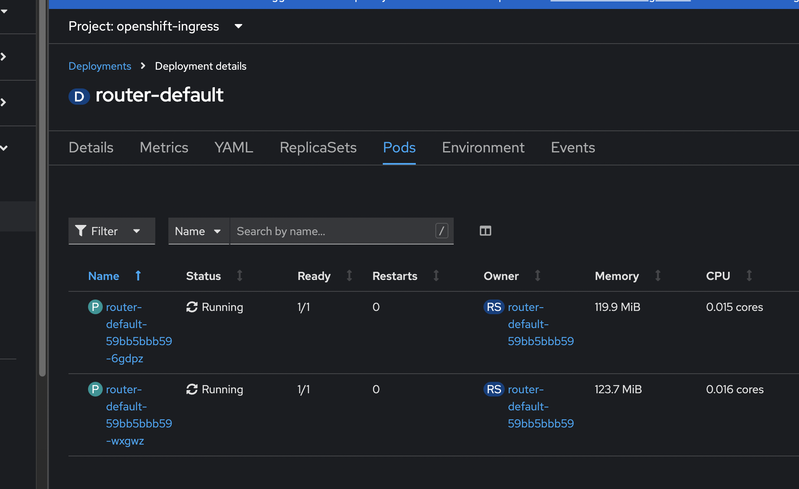
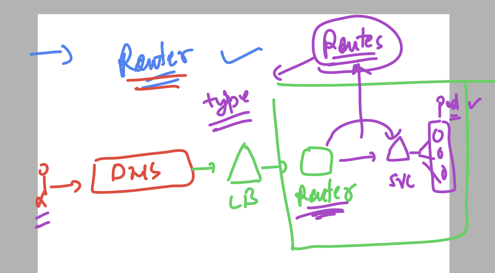
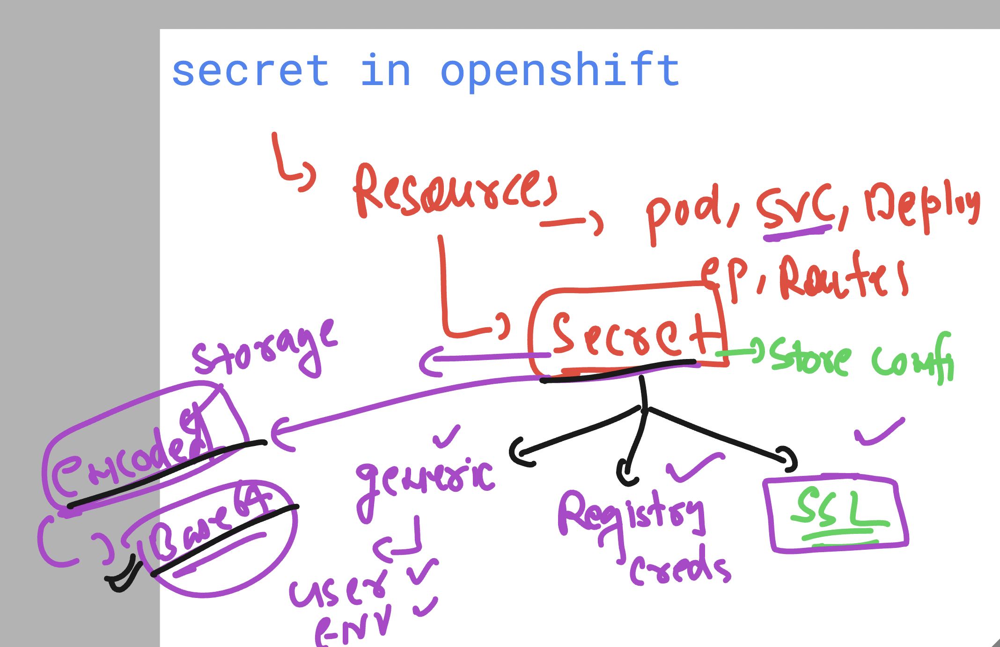
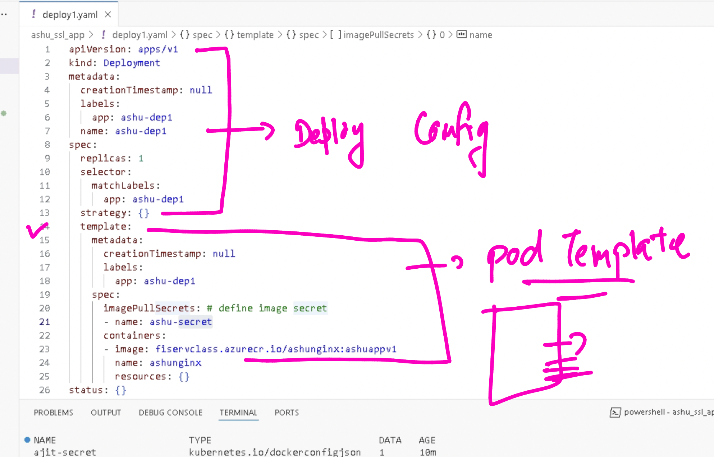
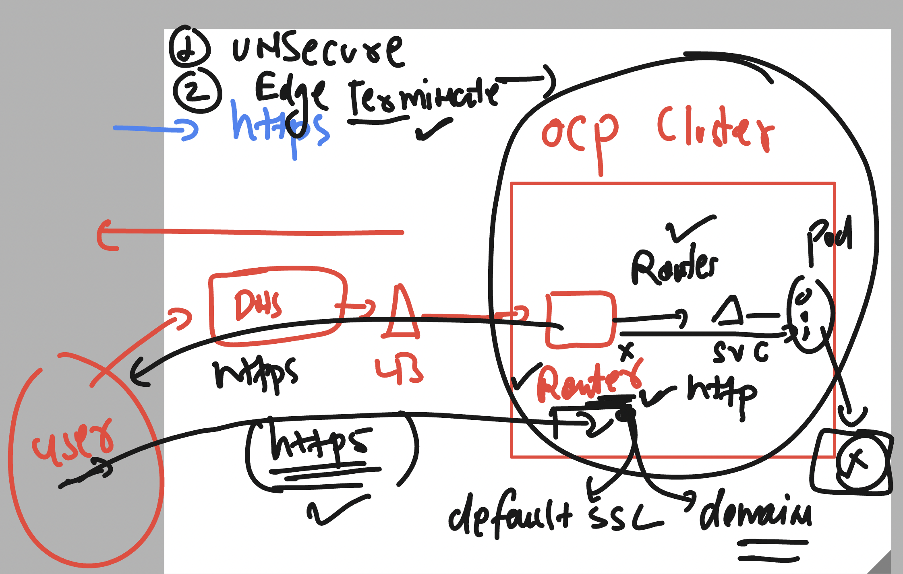
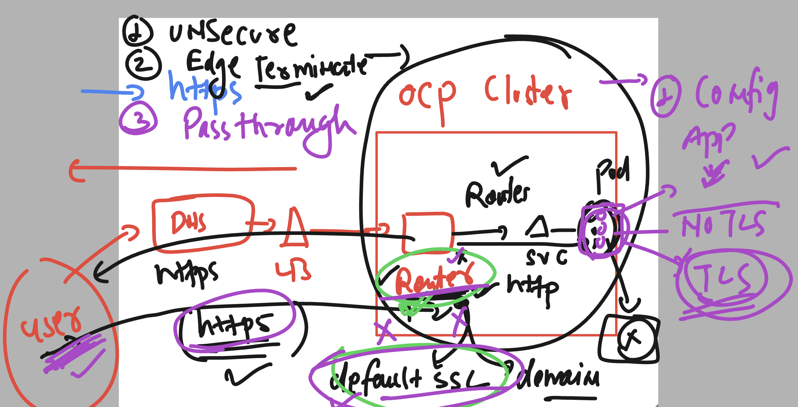

## Verify oc connection from client to control plane 

```
PS C:\Users\labuser> oc  version
Client Version: 4.18.0-ec.4
Kustomize Version: v5.4.2
Server Version: 4.16.30
Kubernetes Version: v1.29.10+67d3387
PS C:\Users\labuser> oc cluster-info
Kubernetes control plane is running at https://api.hm9pf1p6kad6e4221e.eastus.aroapp.io:6443

To further debug and diagnose cluster problems, use 'kubectl cluster-info dump'.
PS C:\Users\labuser> oc  get nodes
NAME                                        STATUS   ROLES                  AGE    VERSION
fiserv-cluster-9dkff-master-0               Ready    control-plane,master   3d1h   v1.29.10+67d3387
fiserv-cluster-9dkff-master-1               Ready    control-plane,master   3d1h   v1.29.10+67d3387
fiserv-cluster-9dkff-master-2               Ready    control-plane,master   3d1h   v1.29.10+67d3387
fiserv-cluster-9dkff-worker-eastus1-rwvz2   Ready    worker                 3d1h   v1.29.10+67d3387
fiserv-cluster-9dkff-worker-eastus2-rfppk   Ready    worker                 3d1h   v1.29.10+67d3387
fiserv-cluster-9dkff-worker-eastus3-cnwzm   Ready    worker                 3d1h   v1.29.10+67d3387
PS C:\Users\labuser>

```


## openshift Networking with Routes 

### checking openshift router status 




### more verification 

```
PS C:\Users\labuser> oc  get  deploy  -n  openshift-ingress
NAME             READY   UP-TO-DATE   AVAILABLE   AGE
router-default   2/2     2            2           3d1h
PS C:\Users\labuser> oc  get po   -n  openshift-ingress
NAME                              READY   STATUS    RESTARTS   AGE
router-default-59bb5bbb59-6gdpz   1/1     Running   0          3d1h
router-default-59bb5bbb59-wxgwz   1/1     Running   0          3d1h
PS C:\Users\labuser> oc  get svc    -n  openshift-ingress
NAME                      TYPE           CLUSTER-IP      EXTERNAL-IP     PORT(S)                      AGE
router-default            LoadBalancer   172.30.83.147   74.235.210.35   80:31603/TCP,443:30600/TCP   3d2h
router-internal-default   ClusterIP      172.30.88.85    <none>          80/TCP,443/TCP,1936/TCP      3d1h
PS C:\Users\labuser>

```
### openshift router and service traffic redirection by routes 



## Info about secret in openshift / k8s 



## Creating secret to store registry creds to pull images from private registry 

```
PS C:\Users\labuser\Desktop\ashu-project\ashu_ssl_app> oc  create  secret
Create a secret with specified type.

 A docker-registry type secret is for accessing a container registry.

 A generic type secret indicate an Opaque secret type.

 A tls type secret holds TLS certificate and its associated key.     

Available Commands:
  docker-registry   Create a secret for use with a Docker registry
  generic           Create a secret from a local file, directory, or literal value   
  tls               Create a TLS secret

Usage:
  oc create secret (docker-registry | generic | tls) [options]

===> creating secret 

  oc  create  secret  docker-registry  ashu-secret  --docker-server fiservclass.azurecr.io   --docker-username  fiservclass --docker-password  "type your password" --dry-run=client -o yaml         >secret1.yaml 

===> oc create -f secret1.yaml 

 C:\Users\labuser\Desktop\ashu-project\ashu_ssl_app> oc  get  secret 
NAME                       TYPE                             DATA   AGE  
amitregcred                kubernetes.io/dockerconfigjson   1      19m  
ashu-secret                kubernetes.io/dockerconfigjson   1      6s   

```

## Creating deployment YAML 

```
oc  create  deployment  ashu-dep1 --image fiservclass.azurecr.io/ashunginx:ashuappv1 
 --dry-run=client -o yaml >deploy1.yaml 

===> use secret in deployment yaml 
- so that openshift can use that secret to pull docker image from registry 

```

### Understanding deployment file 



### creating service 

```
oc  expose deploy  ashu-dep1  --port 80 --target-port 80 --name ashu-lb1 --dry-run=client  -o yaml >clusterIPsvc.yaml


===>

PS C:\Users\labuser\Desktop\ashu-project\ashu_ssl_app> oc create  -f .\clusterIPsvc.yaml
service/ashu-lb1 created
PS C:\Users\labuser\Desktop\ashu-project\ashu_ssl_app> oc get service 
NAME         TYPE        CLUSTER-IP       EXTERNAL-IP   PORT(S)   AGE
ajit-lb1     ClusterIP   172.30.51.125    <none>        80/TCP    2m27s
amit-lb1     ClusterIP   172.30.204.248   <none>        80/TCP    24s
ashi-lb1     ClusterIP   172.30.71.7      <none>        80/TCP    73s
ashu-lb1     ClusterIP   172.30.254.235   <none>        80/TCP    6s
```

### creating route  of unsecure type 

```
PS C:\Users\labuser\Desktop\ashu-project\ashu_ssl_app> oc  expose  service  ashu-lb1  --name ashu-app1 --dry-run=client -o yaml 
apiVersion: route.openshift.io/v1
kind: Route
metadata:
  creationTimestamp: null
  labels:
    app: ashu-dep1
  name: ashu-app1
spec:
  port:
    targetPort: 80
  to:
    kind: ""
    name: ashu-lb1
    weight: null
status: {}
PS C:\Users\labuser\Desktop\ashu-project\ashu_ssl_app> oc  expose  service  ashu-lb1  --name ashu-app1 --dry-run=client -o yaml >ashuroute1.yaml 

===> 
oc create -f ashuroute1.yaml 
oc get route

```

## Edge termination type tLS 



### Creating route of Edge 

```
PS C:\Users\labuser\Desktop\ashu-project\ashu_ssl_app> oc create route  edge ashu-app2  --service ashu-lb1 --dry-run=client -o yaml
apiVersion: route.openshift.io/v1
kind: Route
metadata:
  creationTimestamp: null
  labels:
    app: ashu-dep1
  name: ashu-app2
spec:
  tls:
    termination: edge
  to:
    kind: ""
    name: ashu-lb1
    weight: null
status: {}
PS C:\Users\labuser\Desktop\ashu-project\ashu_ssl_app> oc create route  edge ashu-app2  --service ashu-lb1 --dry-run=client -o yaml >ashu_edge.yaml
PS C:\Users\labuser\Desktop\ashu-project\ashu_ssl_app> oc create  -f .\ashu_edge.yaml
route.route.openshift.io/ashu-app2 created

```

### Passthrough TLS route 



