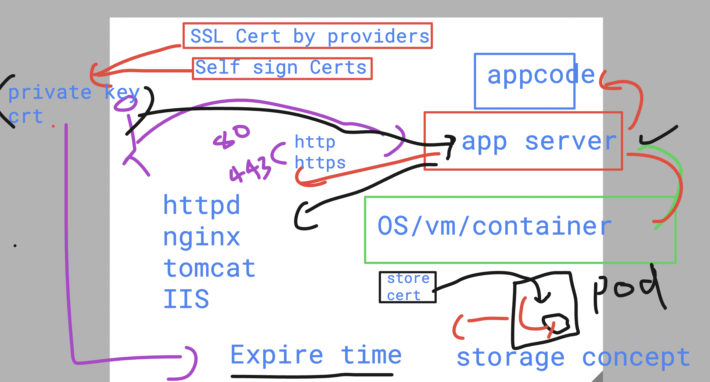
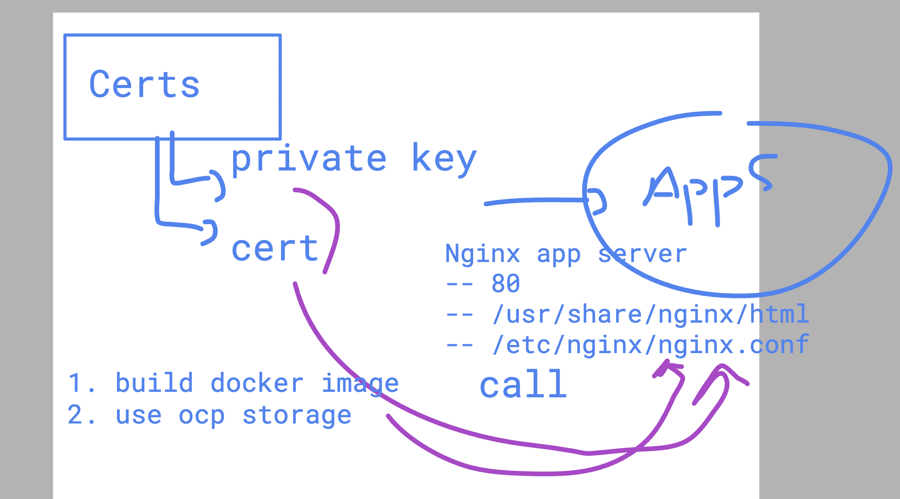
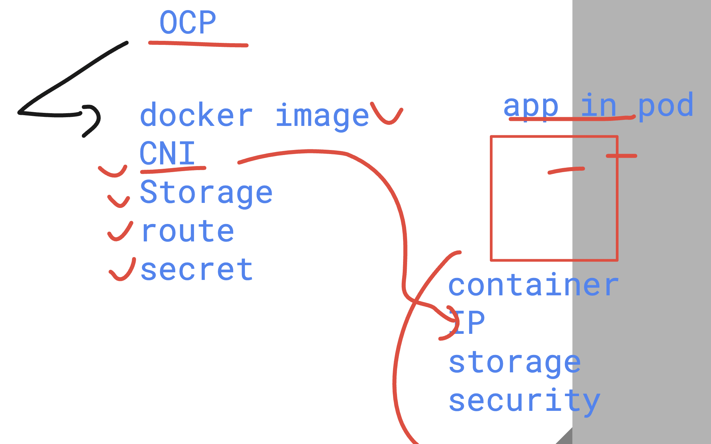
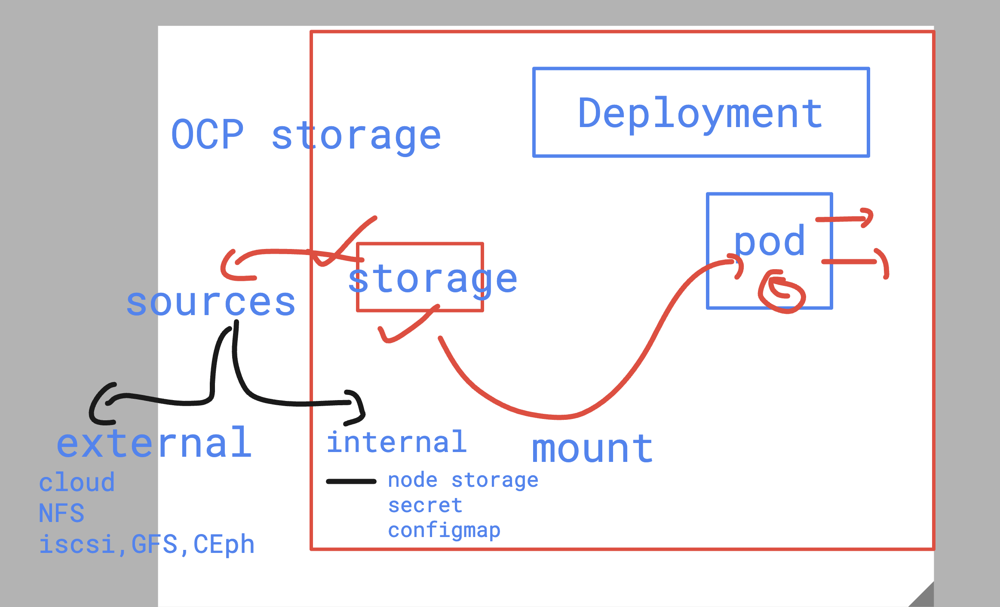
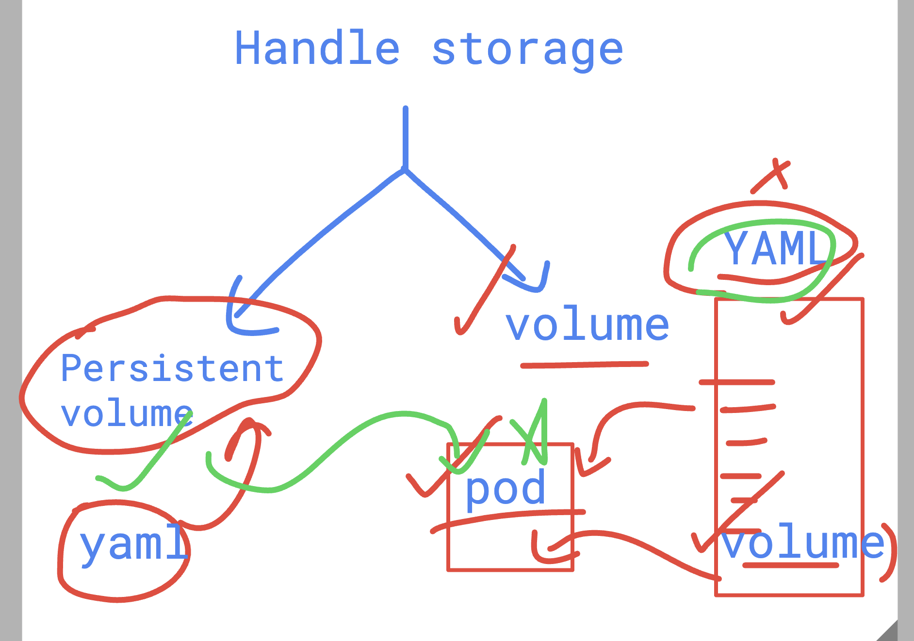

## Understanding basic Certs concept in Ocp pods 



### ssl cert with nginx  app server 



### check nginx config file detail using docker container 

```bash

PS C:\Users\labuser> docker  run -d -it --name ashucheck nginx
Unable to find image 'nginx:latest' locally
latest: Pulling from library/nginx
32ef64864ec3: Download complete
b0c073cda91f: Download complete
e6557c42ebea: Download complete
8a628cdd7ccc: Download complete
ec74683520b9: Download complete
6c95adab80c5: Download complete
ad8a0171f43e: Download complete
Digest: sha256:5ed8fcc66f4ed123c1b2560ed708dc148755b6e4cbd8b943fab094f2c6bfa91e
Status: Downloaded newer image for nginx:latest
a37e795703c78392c9d2fb864c216b731e774212be7b37c5c78198bc344cae0c
PS C:\Users\labuser>
PS C:\Users\labuser> docker  ps
CONTAINER ID   IMAGE     COMMAND                  CREATED          STATUS          PORTS     NAMES
a37e795703c7   nginx     "/docker-entrypoint.…"   25 seconds ago   Up 15 seconds   80/tcp    ashucheck


PS C:\Users\labuser> docker  exec  -it  ashucheck  /bin/bash
root@a37e795703c7:/# 

```

### openshift to pod requirements 



### storage in Openshift platfomr 



### in ocp we can create and handle storage by given option 



