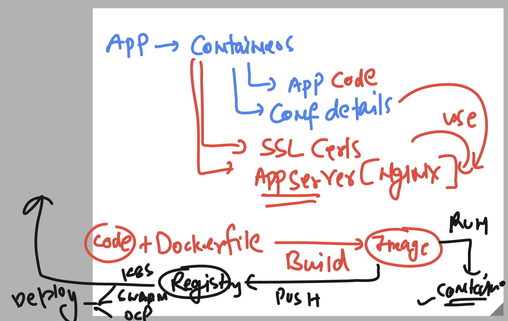
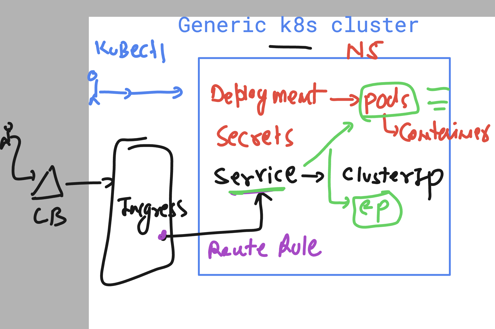
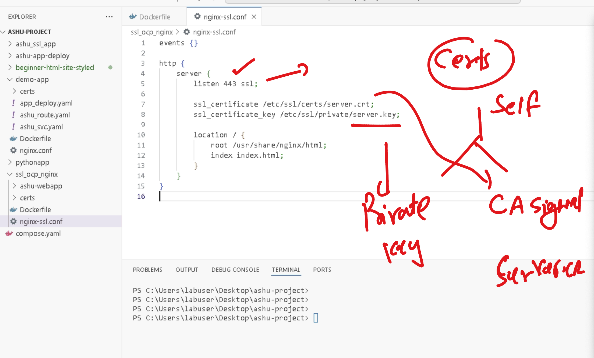
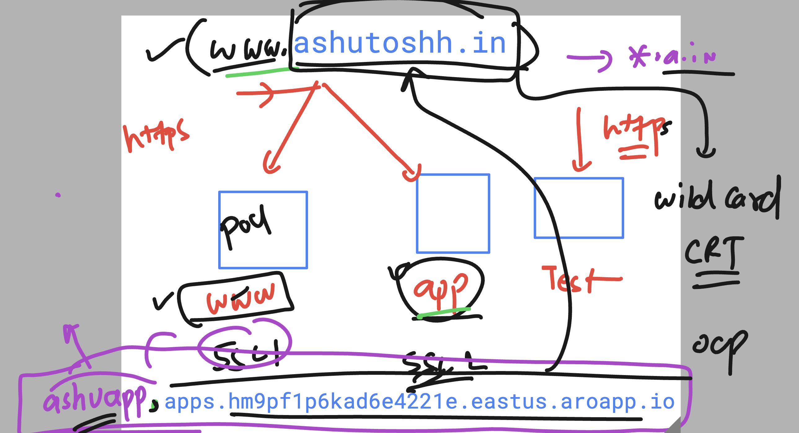

# Revision 

## app to container process 



## k8s app deployment process 



## every app server is having some config to enable SSL setting 



## Keeping openshift router based domain to deploy custom pod app 



## build image and create container to access app using https 

```
 7 cd  .\ssl_ocp_nginx\
   8 ls
   9 docker build  -t  ashussl:v1  .
  10 docker run -itd --name ashuc1 -p 1122:443   ashussl:v1
  11 docker  ps

```
