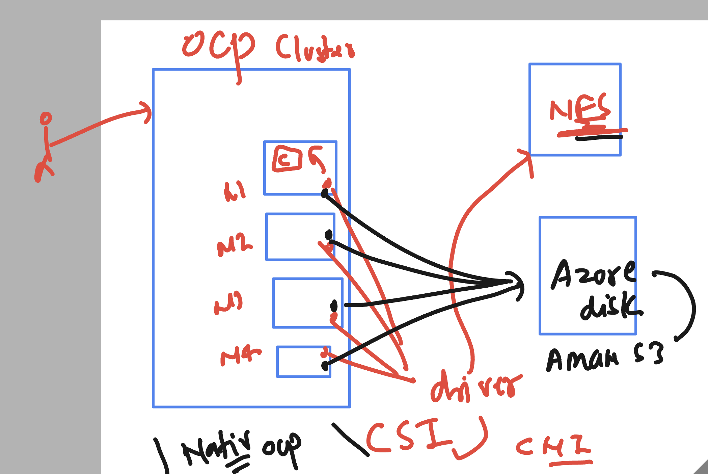
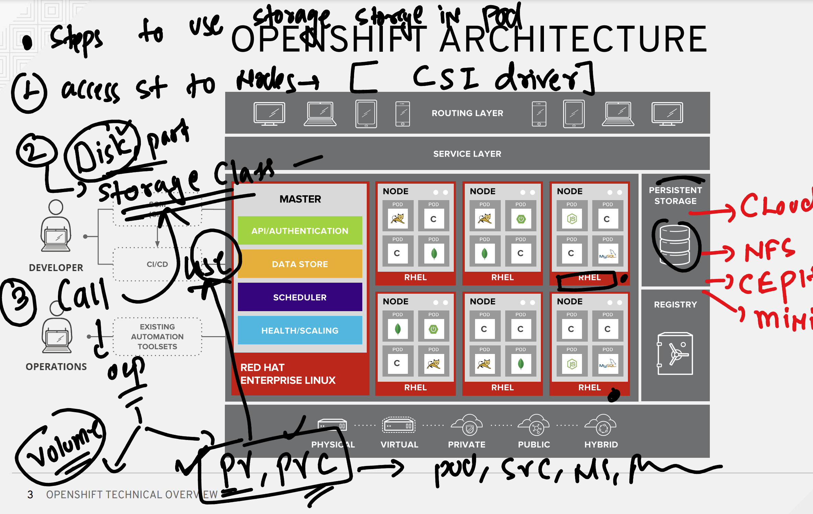
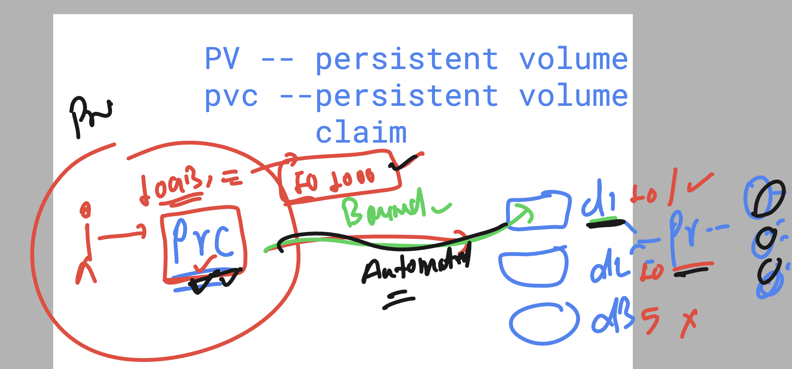
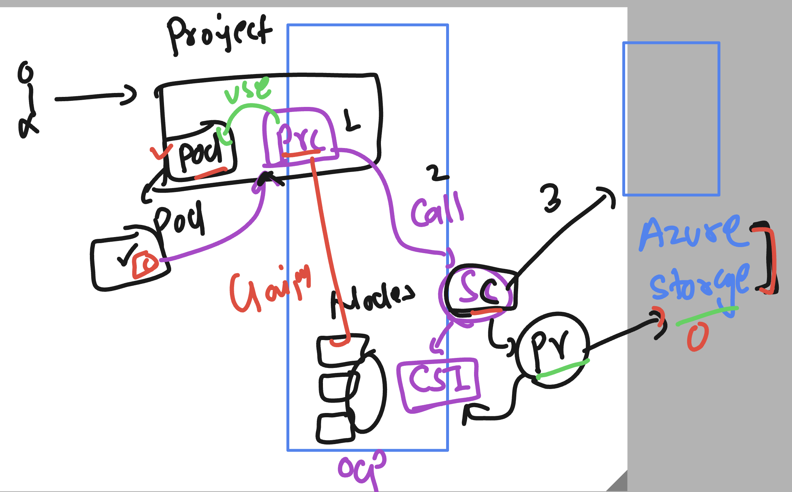

# Docker SSL webapp Revision 

## Docker image with SSL certs 


### Creating a seperate directory to keep all ocp manifest files in single place 

```
PS C:\Users\labuser\Desktop\ashu-project> cd  .\ssl_ocp_nginx\
PS C:\Users\labuser\Desktop\ashu-project\ssl_ocp_nginx> ls


    Directory: C:\Users\labuser\Desktop\ashu-project\ssl_ocp_nginx


Mode                 LastWriteTime         Length Name
----                 -------------         ------ ----
d-----         4/28/2025   1:27 PM                ashu-webapp
d-----         4/28/2025   1:17 PM                certs
-a----         4/28/2025   1:29 PM            503 Dockerfile
-a----         4/28/2025  12:45 PM            289 nginx-ssl.conf


PS C:\Users\labuser\Desktop\ashu-project\ssl_ocp_nginx> mkdir   ocp_deploy


    Directory: C:\Users\labuser\Desktop\ashu-project\ssl_ocp_nginx


Mode                 LastWriteTime         Length Name
----                 -------------         ------ ----
d-----         4/29/2025  11:45 AM                ocp_deploy


PS C:\Users\labuser\Desktop\ashu-project\ssl_ocp_nginx> cd  .\ocp_deploy\
PS C:\Users\labuser\Desktop\ashu-project\ssl_ocp_nginx\ocp_deploy> 

```
### we have secret so lets create deployment 

```
 oc  create  deployment  ashu-ssl-app --image=fiservclass.azurecr.io/ashussl:fiservssl  --port 443 --dry-run=client -o yaml >deploy.yaml 

 ===> we have to call secret in deploy.yaml so that ocp nodes can use to pull image

 == Modifed deploy.yaml file 
 apiVersion: apps/v1
kind: Deployment
metadata:
  creationTimestamp: null
  labels:
    app: ashu-ssl-app
  name: ashu-ssl-app
spec:
  replicas: 1
  selector:
    matchLabels:
      app: ashu-ssl-app
  strategy: {}
  template:
    metadata:
      creationTimestamp: null
      labels:
        app: ashu-ssl-app
    spec:
      imagePullSecrets: # calling secret to pull image 
      - name: ashu-secret # name of secret in current project 
      containers:
      - image: fiservclass.azurecr.io/ashussl:fiservssl
        name: ashussl
        ports:
        - containerPort: 443
        resources: {}
status: {}

```

### a visual changes 


### doing it with oc cli 

```
PS C:\Users\labuser\Desktop\ashu-project\ssl_ocp_nginx\ocp_deploy> oc create -f .\deploy.yaml
deployment.apps/ashu-ssl-app created
PS C:\Users\labuser\Desktop\ashu-project\ssl_ocp_nginx\ocp_deploy> oc  get  deploy
NAME             READY   UP-TO-DATE   AVAILABLE   AGE  
ajit-ssl-app     0/1     1            0           2m19s
amit-ssl-app     1/1     1            1           18s  
ashu-ssl-app     1/1     1            1           5s   
rayudu-ssl-app   1/1     1            1           2s   
PS C:\Users\labuser\Desktop\ashu-project\ssl_ocp_nginx\ocp

```

### creating service by exposing deployment 

```
oc  expose deployment ashu-ssl-app   --type ClusterIP --port 443 --target-port 443 --name ashu-lb 

```
## Now finally route 

```
 oc create route passthrough  ashu-route --service ashu-lb16  --port 443  
--hostname  ashuapp.apps.hm9pf1p6kad6e4221e.eastus.aroapp.io --dry-run=client -o yaml >route1.yaml


===>

PS C:\Users\labuser\Desktop\ashu-project\ssl_ocp_nginx\ocp_deploy> oc create route passthrough  ashu-route --service ashu-lb16  --port 443  
--hostname  ashuapp.apps.hm9pf1p6kad6e4221e.eastus.aroapp.io --dry-run=client -o yaml >route1.yaml 
PS C:\Users\labuser\Desktop\ashu-project\ssl_ocp_nginx\ocp_deploy>
PS C:\Users\labuser\Desktop\ashu-project\ssl_ocp_nginx\ocp_deploy>
PS C:\Users\labuser\Desktop\ashu-project\ssl_ocp_nginx\ocp_deploy> oc  create -f  .\route1.yaml
route.route.openshift.io/ashu-route created
PS C:\Users\labuser\Desktop\ashu-project\ssl_ocp_nginx\ocp_deploy> oc  get routes
NAME         HOST/PORT                                          PATH   SERVICES    PORT   TERMINATION   WILDCARD
amit-route   amitapp.apps.hm9pf1p6kad6e4221e.eastus.aroapp.io          amit-lb16   443    passthrough   None
ashu-route   ashuapp.apps.hm9pf1p6kad6e4221e.eastus.aroapp.io     

```

## Storage in OCP platform 

### info about CSI 



### to USe storage class we need to create PV , PVC in ocp 



### checking storage class if we have 

```
humanfirmware@darwin  ~  oc  get  storageclass 
NAME                    PROVISIONER          RECLAIMPOLICY   VOLUMEBINDINGMODE      ALLOWVOLUMEEXPANSION   AGE
azurefile-csi           file.csi.azure.com   Delete          Immediate              true                   9d
managed-csi (default)   disk.csi.azure.com   Delete          WaitForFirstConsumer   true                   9d
 humanfirmware@darwin  ~  
 humanfirmware@darwin  ~  
 humanfirmware@darwin  ~  oc  get  sc           
NAME                    PROVISIONER          RECLAIMPOLICY   VOLUMEBINDINGMODE      ALLOWVOLUMEEXPANSION   AGE
azurefile-csi           file.csi.azure.com   Delete          Immediate              true                   9d
managed-csi (default)   disk.csi.azure.com   Delete          WaitForFirstConsumer   true                   9d
 humanfirmware@darwin  ~  

```

## PV and PVC 



### Storage in OCP 



## Creating PVc using dynamic storage class 

```bash
apiVersion: v1
kind: PersistentVolumeClaim
metadata:
  name: ashu-pvc1 # name of pvc 
spec:
  accessModes:
    - ReadWriteMany # many ocp nodes can do RW operations 
  storageClassName: azurefile-csi # name of storage class 
  resources:
    requests:
      storage: 10Gi  # size of claim 5 to 15 GB 


===>
PS C:\Users\labuser\Desktop\ashu-project\ssl_ocp_nginx\ocp_deploy>
PS C:\Users\labuser\Desktop\ashu-project\ssl_ocp_nginx\ocp_deploy> oc  get  sc
NAME                    PROVISIONER          RECLAIMPOLICY   VOLUMEBINDINGMODE      ALLOWVOLUMEEXPANSION   AGE
azurefile-csi           file.csi.azure.com   Delete          Immediate              true                   9d 
managed-csi (default)   disk.csi.azure.com   Delete          WaitForFirstConsumer   true                   9d 
PS C:\Users\labuser\Desktop\ashu-project\ssl_ocp_nginx\ocp_deploy> oc  create  -f  .\ashu-pvc.yaml
persistentvolumeclaim/ashu-pvc1 created
PS C:\Users\labuser\Desktop\ashu-project\ssl_ocp_nginx\ocp_deploy> oc  get  pvc
NAME          STATUS   VOLUME                                     CAPACITY   ACCESS MODES   STORAGECLASS    VOLUMEATTRIBUTESCLASS   AGE
ashu-pvc1     Bound    pvc-05a0b89a-5268-4809-a836-0adf65096800   10Gi       RWX            azurefile-csi   <unset>                 7s 
rayudu-pvc1   Bound    pvc-31b772aa-53bd-4ce0-907b-a7e19e8dcbcc   10Gi       RWX            azurefile-csi   <unset>                 2s 
PS C:\Users\labuser\Desktop\ashu-project\ssl_ocp_nginx\ocp_deploy> 

```

### Due to dynamic storage class PV got automatically created

```
 humanfirmware@darwin  ~/Desktop/demos  oc get pv
NAME                                       CAPACITY   ACCESS MODES   RECLAIM POLICY   STATUS   CLAIM                 STORAGECLASS    VOLUMEATTRIBUTESCLASS   REASON   AGE
pvc-05a0b89a-5268-4809-a836-0adf65096800   10Gi       RWX            Delete           Bound    default/ashu-pvc1     azurefile-csi   <unset>                          2m32s
pvc-31b772aa-53bd-4ce0-907b-a7e19e8dcbcc   10Gi       RWX            Delete           Bound    default/rayudu-pvc1   azurefile-csi   <unset>                          2m28s
pvc-75ccb820-7712-40f8-a944-cd6666c5f806   15Gi       RWX            Delete           Bound    default/rohan-pvc1    azurefile-csi   <unset>                          2m17s
pvc-83248ce2-112d-4ab7-a2b8-6805255e8466   5Gi        RWX            Delete           Bound    default/asif-pvc1     azurefile-csi   <unset>                          2m5s
pvc-8efe69a2-6d11-450d-bfff-2a9071fc352e   10Gi       RWX            Delete           Bound    default/krish-pvc1    azurefile-csi   <unset>                          2m22s
pvc-97fddbb5-673b-4802-824b-0dda5fbc943e   12Gi       RWX            Delete           Bound    default/amit-pvc1     azurefile-csi   <unset>                          2m5s
pvc-aaccc827-0066-473f-b5f5-45ecc94602de   10Gi       RWX            Delete           Bound    default/jh-pvc1       azurefile-csi   <unset>                          52s
pvc-fc6c8cf4-123e-43ee-bce4-95213110a8e8   5Gi        RWX            Delete           Bound    default/manoj-pvc1    azurefile-csi   <unset>                          2m16s
 humanfirmware@darwin  ~/Desktop/demos  

```

