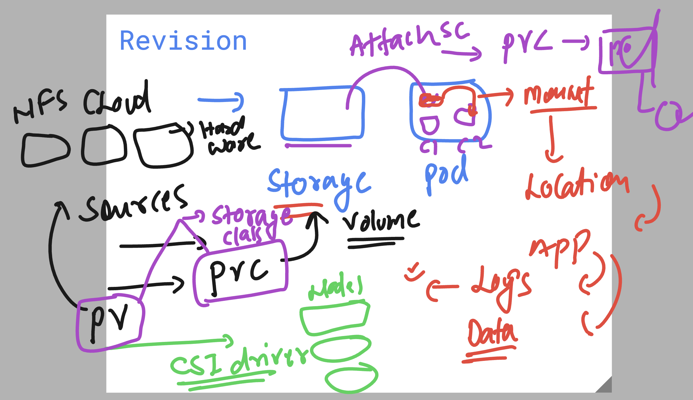
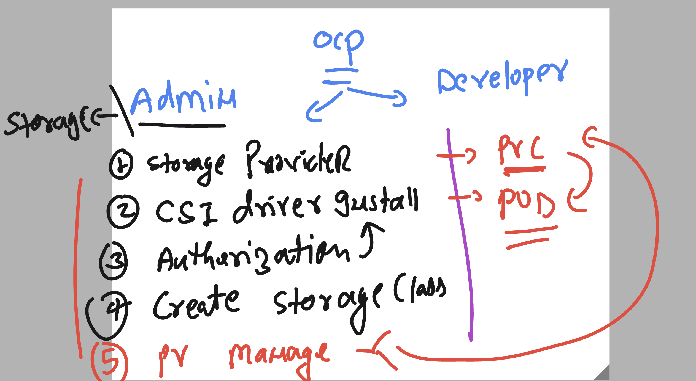

# Revision of OCP storage 



## Roles of ocp admin/Dev for Storage related details 



### checking list of APi resources in my current OCP cluster ENV 

```
humanfirmware@darwin  ~  oc  api-resources 
NAME                                  SHORTNAMES                                                                             APIVERSION                                    NAMESPACED   KIND
bindings                                                                                                                     v1                                            true         Binding
componentstatuses                     cs                                                                                     v1                                            false        ComponentStatus
configmaps                            cm                                                                                     v1                                            true         ConfigMap
endpoints                             ep                                                                                     v1                                            true         Endpoints
events                                ev                                                                                     v1                                            true         Event
limitranges                           limits                                                                                 v1                                            true         LimitRange
namespaces                            ns                                                                                     v1                                            false        Namespace
nodes                                 no                                                                                     v1                                            false        Node
persistentvolumeclaims                pvc                                                                                    v1                                            true         PersistentVolumeClaim
persistentvolumes                     pv                                                              

```


## Creating PVC using dynamic stroage class 


### PVC yaml content 

```yaml
apiVersion: v1
kind: PersistentVolumeClaim
metadata:
  name: ashu-pvc1 # name of pvc 
spec:
  accessModes:
    - ReadWriteMany # many ocp nodes can do RW operations 
  storageClassName: azurefile-csi # name of storage class 
  resources:
    requests:
      storage: 10Gi  # size of claim 5 to 15 GB 
```
