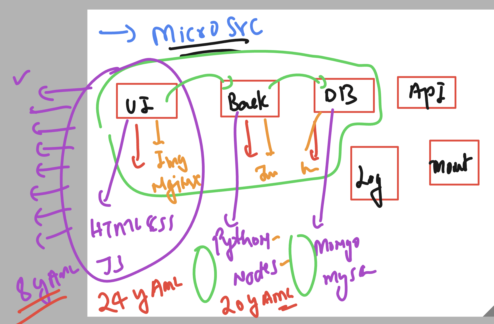

# Revision of OCP storage 


## Roles of ocp admin/Dev for Storage related details 


### checking list of APi resources in my current OCP cluster ENV 

```
humanfirmware@darwin  ~  oc  api-resources 
NAME                                  SHORTNAMES                                                                             APIVERSION                                    NAMESPACED   KIND
bindings                                                                                                                     v1                                            true         Binding
componentstatuses                     cs                                                                                     v1                                            false        ComponentStatus
configmaps                            cm                                                                                     v1                                            true         ConfigMap
endpoints                             ep                                                                                     v1                                            true         Endpoints
events                                ev                                                                                     v1                                            true         Event
limitranges                           limits                                                                                 v1                                            true         LimitRange
namespaces                            ns                                                                                     v1                                            false        Namespace
nodes                                 no                                                                                     v1                                            false        Node
persistentvolumeclaims                pvc                                                                                    v1                                            true         PersistentVolumeClaim
persistentvolumes                     pv                                                              

```


## Creating PVC using dynamic stroage class 


### PVC yaml content 

```yaml
apiVersion: v1
kind: PersistentVolumeClaim
metadata:
  name: ashu-pvc1 # name of pvc 
spec:
  accessModes:
    - ReadWriteMany # many ocp nodes can do RW operations 
  storageClassName: azurefile-csi # name of storage class 
  resources:
    requests:
      storage: 10Gi  # size of claim 5 to 15 GB 
```

## Creating pod with consuming pvc 

```
apiVersion: v1
kind: Pod
metadata:
  name: mypod
spec:
  containers:
    - name: myfrontend
      image: nginx
      volumeMounts:
      - mountPath: "/var/www/html"
        name: mypd
  volumes:
    - name: mypd
      persistentVolumeClaim:
        claimName: myclaim
```

### Creating deployment with pvc used in pod 

```
 oc  create -f .\deploy.yaml
===>
PS C:\Users\labuser\Desktop\ashu-project\ssl_ocp_nginx\ocp_deploy> oc  describe deploy ashu-ssl-app
Name:                   ashu-ssl-app
Namespace:              default
CreationTimestamp:      Wed, 30 Apr 2025 12:28:53 +0000
Labels:                 app=ashu-ssl-app
Annotations:            deployment.kubernetes.io/revision: 2
Selector:               app=ashu-ssl-app
Replicas:               1 desired | 1 updated | 1 total | 1 available | 0 unavailable
StrategyType:           RollingUpdate
MinReadySeconds:        0
RollingUpdateStrategy:  25% max unavailable, 25% max surge
Pod Template:
```

### Bundle of yaml just to deploy sample app in k8s / ocp 


### More app components mean more YAML manifesting 



## Solution by packaging YAML manifest files 


## Intro to HELM 


## starting with HELM 

### checking version 

```
helm version 

```

### listing and adding repos 

```
PS C:\Users\labuser\Desktop\ashu-project\ssl_ocp_nginx\ocp_deploy> helm repo ls
Error: no repositories to show
PS C:\Users\labuser\Desktop\ashu-project\ssl_ocp_nginx\ocp_deploy>   

==>
PS C:\Users\labuser\Desktop\ashu-project\ssl_ocp_nginx\ocp_deploy> helm repo add ashu-repo1  https://charts.bitnami.com/bitnami
"ashu-repo1" has been added to your repositories
PS C:\Users\labuser\Desktop\ashu-project\ssl_ocp_nginx\ocp_deploy> 
PS C:\Users\labuser\Desktop\ashu-project\ssl_ocp_nginx\ocp_deploy> 
PS C:\Users\labuser\Desktop\ashu-project\ssl_ocp_nginx\ocp_deploy> helm repo ls
NAME            URL
ashu-repo1      https://charts.bitnami.com/bitnami
PS C:\Users\labuser\Desktop\ashu-project\ssl_ocp_nginx\ocp_deploy> 

```

### search for packages in Repo 

```
PS C:\Users\labuser\Desktop\ashu-project\ssl_ocp_nginx\ocp_deploy> helm search repo nginx 
NAME                                    CHART VERSION   APP VERSION     DESCRIPTION
ashu-repo1/nginx                        20.0.0          1.28.0          NGINX Open Source is a web server that can be a...
ashu-repo1/nginx-ingress-controller     11.6.15         1.12.1          NGINX Ingress Controller is an Ingress controll...
ashu-repo1/nginx-intel                  2.1.15          0.4.9           DEPRECATED NGINX Open Source for Intel is a lig...
PS C:\Users\labuser\Desktop\ashu-project\ssl_ocp_nginx\ocp_deploy> 

```

### switching to k8s cluster for connection 

```
PS C:\Users\labuser\Desktop\ashu-project\ssl_ocp_nginx\ocp_deploy> kubectl config get-contexts 
CURRENT   NAME                                                              CLUSTER                                        AUTHINFO
                                         NAMESPACE
          default/api-cluster-synergificsoftware-com:6443/kube:admin        api-cluster-synergificsoftware-com:6443        kube:admin/api-cluster-synergificsoftware-com:6443        default
*         default/api-hm9pf1p6kad6e4221e-eastus-aroapp-io:6443/kube:admin   api-hm9pf1p6kad6e4221e-eastus-aroapp-io:6443   kube:admin/api-hm9pf1p6kad6e4221e-eastus-aroapp-io:6443   default
          docker-desktop                                                    docker-desktop                                 docker-desktop   

          fiserv-cluster1                                                   fiserv-cluster1                                clusterUser_fiserv-aks_fiserv-cluster1                    ashu-project
          tasks/api-hm9pf1p6kad6e4221e-eastus-aroapp-io:6443/kube:admin     api-hm9pf1p6kad6e4221e-eastus-aroapp-io:6443   kube:admin/api-hm9pf1p6kad6e4221e-eastus-aroapp-io:6443   tasks
PS C:\Users\labuser\Desktop\ashu-project\ssl_ocp_nginx\ocp_deploy> kubectl config use-context  fiserv-cluster1
Switched to context "fiserv-cluster1".
PS C:\Users\labuser\Desktop\ashu-project\ssl_ocp_nginx\ocp_deploy> kubectl  get nodes
NAME                                STATUS   ROLES    AGE   VERSION 
aks-agentpool-33643096-vmss000003   Ready    <none>   18m   v1.30.10
aks-usernodes-33643096-vmss00000f   Ready    <none>   18m   v1.30.10
aks-usernodes-33643096-vmss00000g   Ready    <none>   18m   v1.30.10

```
### cleaning my namespace resoruces 

```
PS C:\Users\labuser\Desktop\ashu-project\ssl_ocp_nginx\ocp_deploy> kubectl.exe  get pods
NAME                           READY   STATUS    RESTARTS   AGE
ashu-deploy-64d8fd7fdf-4n687   1/1     Running   0          27h
ashu-deploy-64d8fd7fdf-lxnnj   1/1     Running   0          27h
PS C:\Users\labuser\Desktop\ashu-project\ssl_ocp_nginx\ocp_deploy> kubectl.exe  delete all --all
pod "ashu-deploy-64d8fd7fdf-4n687" deleted
pod "ashu-deploy-64d8fd7fdf-lxnnj" deleted
service "lb1" deleted
deployment.apps "ashu-deploy" deleted
PS C:\Users\labuser\Desktop\ashu-project\ssl_ocp_nginx\ocp_deploy> 
PS C:\Users\labuser\Desktop\ashu-project\ssl_ocp_nginx\ocp_deploy> kubectl.exe  get pods        
No resources found in ashu-project namespace.
PS C:\Users\labuser\Desktop\ashu-project\ssl_ocp_nginx\ocp_deploy> 

```

### Deploy app using helm in k8s 

```
PS C:\Users\labuser\Desktop\ashu-project\ssl_ocp_nginx\ocp_deploy> helm repo ls
NAME            URL
ashu-repo1      https://charts.bitnami.com/bitnami
===>

PS C:\Users\labuser\Desktop\ashu-project\ssl_ocp_nginx\ocp_deploy> helm search repo nginx
NAME                                    CHART VERSION   APP VERSION     DESCRIPTION
ashu-repo1/nginx                        20.0.0          1.28.0          NGINX Open Source is a web server that can be a...
ashu-repo1/nginx-ingress-controller     11.6.15         1.12.1          NGINX Ingress Controller is an Ingress controll...
ashu-repo1/nginx-intel                  2.1.15          0.4.9           DEPRECATED NGINX Open Source for Intel is a lig...

====>

PS C:\Users\labuser\Desktop\ashu-project\ssl_ocp_nginx\ocp_deploy> helm install ashu-app ashu-repo1/nginx  
NAME: ashu-app
LAST DEPLOYED: Wed Apr 30 13:28:22 2025
NAMESPACE: ashu-project
STATUS: deployed
REVISION: 1
TEST SUITE: None
NOTES:


===> Verify 


PS C:\Users\labuser\Desktop\ashu-project\ssl_ocp_nginx\ocp_deploy> helm  ls
NAME            NAMESPACE       REVISION        UPDATED                                 STATUS          CHART           APP VERSION
ashu-app        ashu-project    1               2025-04-30 13:28:22.4192477 +0000 UTC   deployed        nginx-20.0.0    1.28.0
PS C:\Users\labuser\Desktop\ashu-project\ssl_ocp_nginx\ocp_deploy>
PS C:\Users\labuser\Desktop\ashu-project\ssl_ocp_nginx\ocp_deploy>
PS C:\Users\labuser\Desktop\ashu-project\ssl_ocp_nginx\ocp_deploy>
PS C:\Users\labuser\Desktop\ashu-project\ssl_ocp_nginx\ocp_deploy>
PS C:\Users\labuser\Desktop\ashu-project\ssl_ocp_nginx\ocp_deploy> kubectl  get  deploy
NAME             READY   UP-TO-DATE   AVAILABLE   AGE
ashu-app-nginx   1/1     1            1           83s
PS C:\Users\labuser\Desktop\ashu-project\ssl_ocp_nginx\ocp_deploy>
PS C:\Users\labuser\Desktop\ashu-project\ssl_ocp_nginx\ocp_deploy> kubectl  get  po
NAME                             READY   STATUS    RESTARTS   AGE
ashu-app-nginx-fc8dd7b8b-p84xk   1/1     Running   0          97s
PS C:\Users\labuser\Desktop\ashu-project\ssl_ocp_nginx\ocp_deploy> kubectl  get  svc
NAME             TYPE           CLUSTER-IP     EXTERNAL-IP    PORT(S)                      AGE
ashu-app-nginx   LoadBalancer   10.0.131.132   135.13.22.84   80:30402/TCP,443:31649/TCP   100s


==> Destroying app 

PS C:\Users\labuser\Desktop\ashu-project\ssl_ocp_nginx\ocp_deploy> helm ls
NAME            NAMESPACE       REVISION        UPDATED                                 STATUS          CHART           APP VERSION
ashu-app        ashu-project    1               2025-04-30 13:28:22.4192477 +0000 UTC   deployed        nginx-20.0.0    1.28.0
PS C:\Users\labuser\Desktop\ashu-project\ssl_ocp_nginx\ocp_deploy>
PS C:\Users\labuser\Desktop\ashu-project\ssl_ocp_nginx\ocp_deploy>
PS C:\Users\labuser\Desktop\ashu-project\ssl_ocp_nginx\ocp_deploy> helm uninstall ashu-app 
release "ashu-app" uninstalled
PS C:\Users\labuser\Desktop\ashu-project\ssl_ocp_nginx\ocp_deploy> helm ls
NAME    NAMESPACE       REVISION        UPDATED STATUS  CHART   APP VERSION
PS C:\Users\labuser\Desktop\ashu-project\ssl_ocp_nginx\ocp_deploy>
PS C:\Users\labuser\Desktop\ashu-project\ssl_ocp_nginx\ocp_deploy>
PS C:\Users\labuser\Desktop\ashu-project\ssl_ocp_nginx\ocp_deploy> kubectl.exe  get po
No resources found in ashu-project namespace.
```
