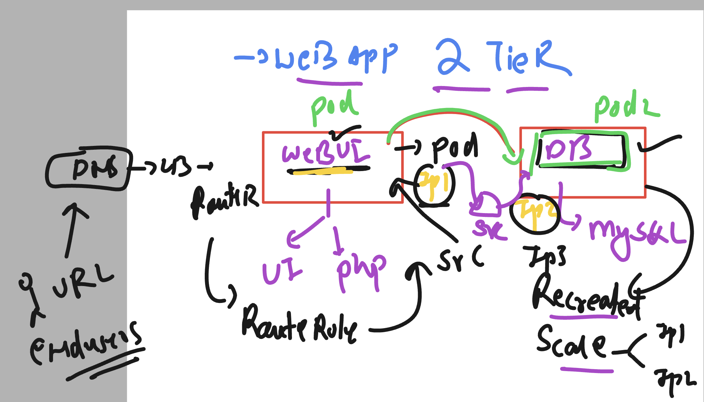
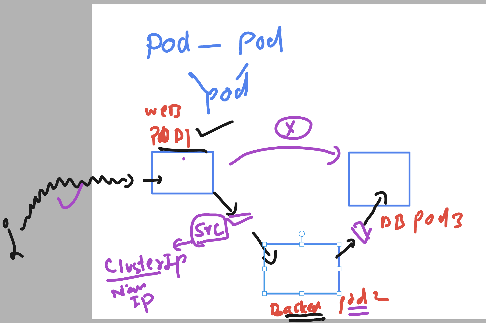

# ocp_container_FSRV_1stapril2025

## Deploy 2 tier webapp in OCP 



### POd to pod communications 



## Creating mysql deployment yaml 

```
 oc create  deployment ashu-mysql --image fiservclass.azurecr.io/mysql:v1  --port 3306 
 --dry-run=client -o yaml >mysql_deploy.yaml

 ==> Some modification are required 
 . storage root creds in secret 

 ===>
  oc  create  secret  generic  ashu-db-creds --from-literal  my-pass=Ashu@12345 --dry-run=client -o yaml >db_cred.yaml 

>>>

apiVersion: apps/v1
kind: Deployment
metadata:
  creationTimestamp: null
  labels:
    app: ashu-mysql
  name: ashu-mysql
spec:
  replicas: 1
  selector:
    matchLabels:
      app: ashu-mysql
  strategy: {}
  template:
    metadata:
      creationTimestamp: null
      labels:
        app: ashu-mysql
    spec:
      imagePullSecrets: # to be used by ocp node for image pulling purpose 
      - name: ashu-secret # calling this secret from current project 
      containers:
      - image: fiservclass.azurecr.io/mysql:v1
        name: mysql
        env: # to call any ENV present in container image 
        - name: MYSQL_ROOT_PASSWORD
          valueFrom: # reading value from somewhere 
            secretKeyRef: # calling ocp secret 
              name: ashu-db-creds # name of secret 
              key: my-pass # key of secret 
        ports:
        - containerPort: 3306
        resources: {}
status: {}


===> MYsql service creation to connect mysql pod 

-->
PS C:\Users\labuser\Desktop\ashu-project\ashu-2t-app> oc  get  deploy
NAME            READY   UP-TO-DATE   AVAILABLE   AGE  
amit-mysql      1/1     1            1           7m55s
ashu-mysql      1/1     1            1           7m31s
asif-deploy     0/1     1            0           24m  
jh-mysql        0/1     1            0           9m25s
manoj-mysql     1/1     1            1           7m30s
rayu-mysql      1/1     1            1           5m34s
rohan-mysql     1/1     1            1           7m23s
sandhya-mysql   1/1     1            1           7m9s 
sid-mysql       1/1     1            1           85s  
PS C:\Users\labuser\Desktop\ashu-project\ashu-2t-app> oc  expose deployment  ashu-mysql --type ClusterIP --port 3306 --name ash-db-lb       
  --dry-run=client -o yaml >mysql_svc.yaml
PS C:\Users\labuser\Desktop\ashu-project\ashu-2t-app> oc create -f .\mysql_svc.yaml   
service/ash-db-lb created
PS C:\Users\labuser\Desktop\ashu-project\ashu-2t-app> oc  get  svc
NAME         TYPE        CLUSTER-IP      EXTERNAL-IP   PORT(S)    AGE
ash-db-lb    ClusterIP   172.30.72.231   <none>        3306/TCP   4s 
kubernetes   ClusterIP   172.30.0.1      <none>        443/TCP    83m
PS C:\Users\labuser\Desktop\ashu-project\ashu-2t-app> 


```