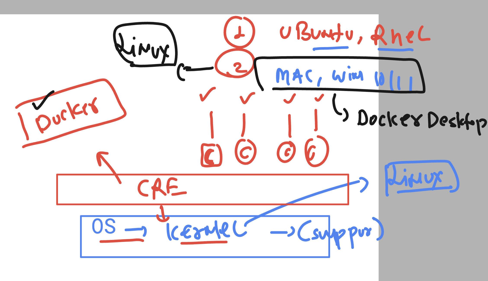
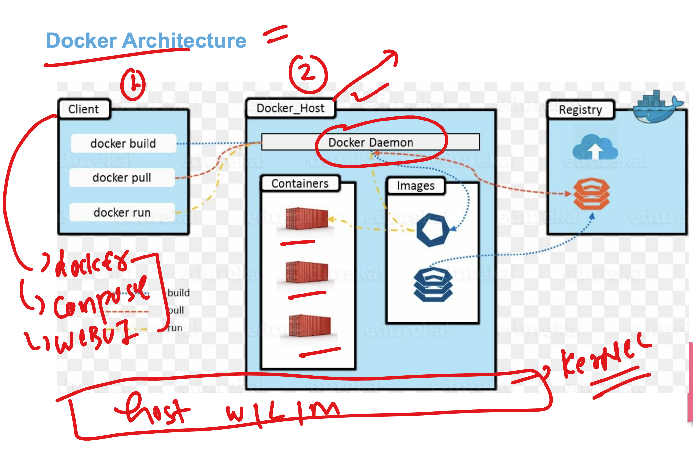
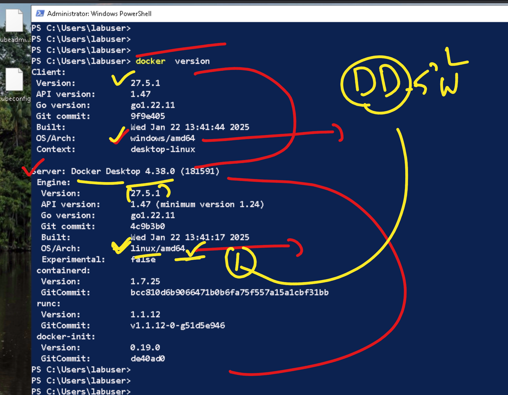
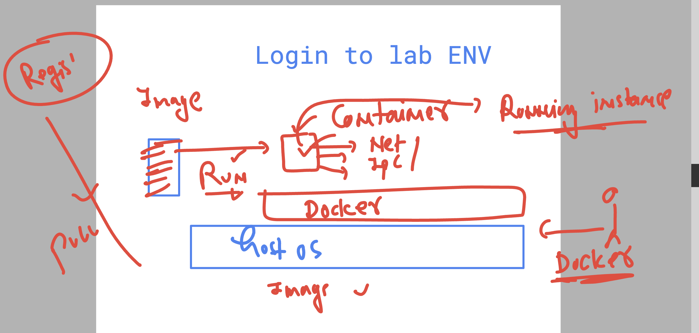
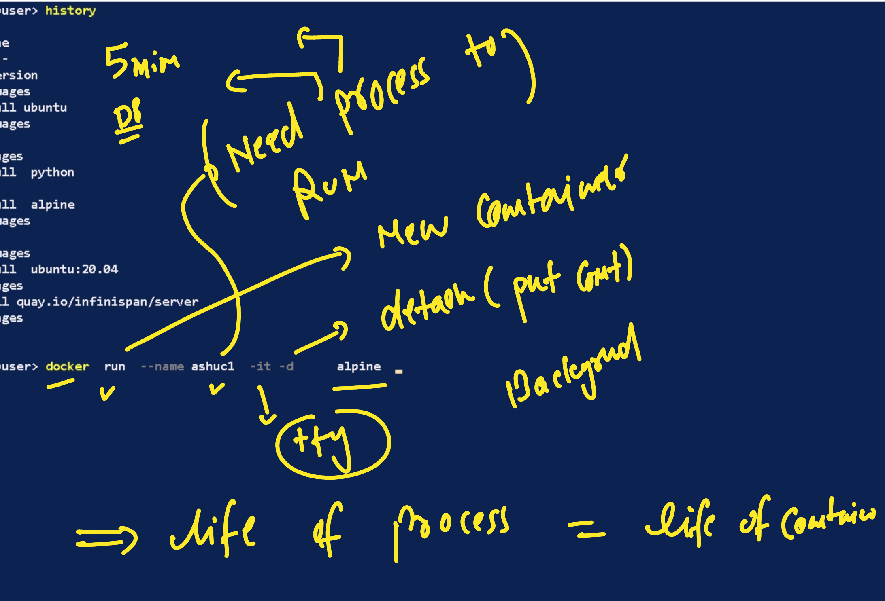
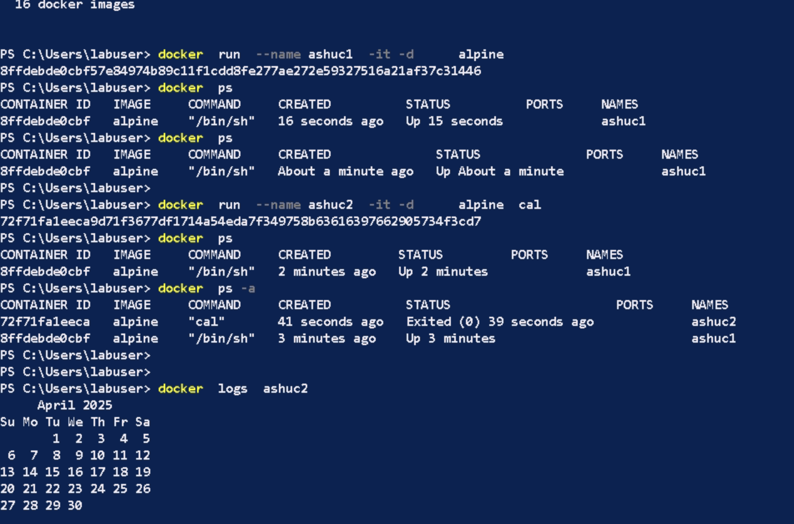
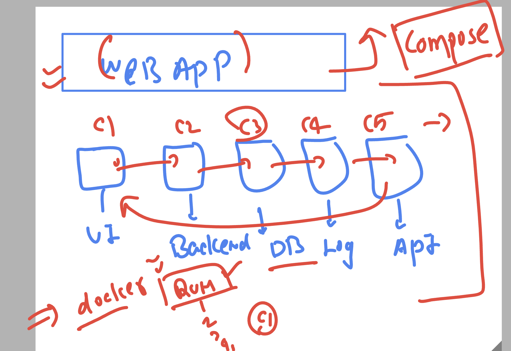
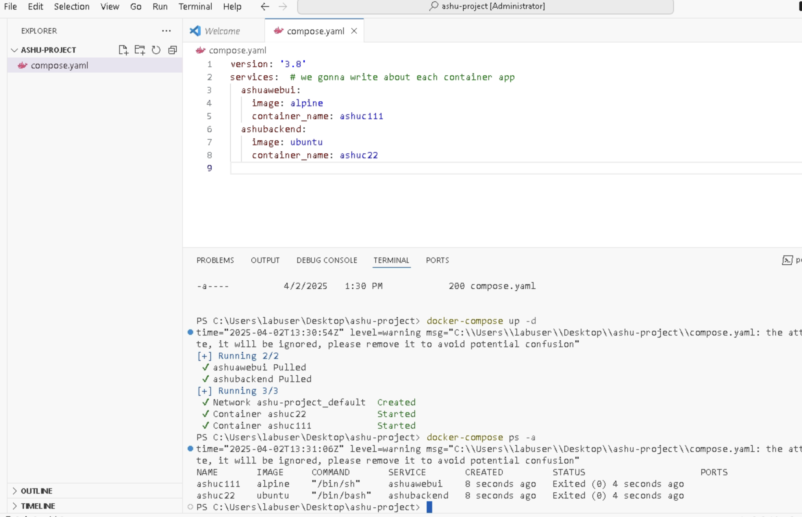

# Containers revision 

### Docker architecture 

## Connecting with docker server (host) from docker client (docker)

### clients options 
- docker
- compose
- sdk
- webui 

###  checking docker client and server version

### Creating containers from images 

### Container need  a process to run 

### Container creation 

### Docker compose -

- client to deal with bulk images and container operations 

### Compose basic example 

