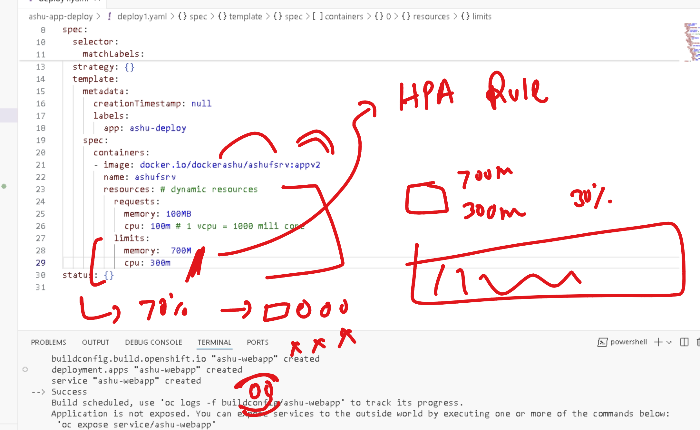
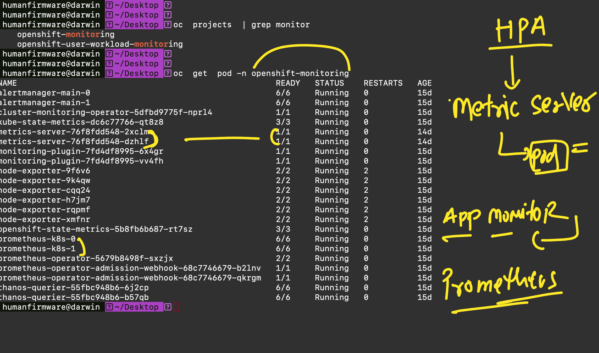

# welcome to final day 

### verify oc login 

```
PS C:\Users\labuser> oc cluster-info
Kubernetes control plane is running at https://api.hm9pf1p6kad6e4221e.eastus.aroapp.io:6443

To further debug and diagnose cluster problems, use 'kubectl cluster-info dump'.
PS C:\Users\labuser> oc get  nodes
NAME                                        STATUS   ROLES                  AGE   VERSION
fiserv-cluster-9dkff-master-0               Ready    control-plane,master   15d   v1.29.10+67d3387
fiserv-cluster-9dkff-master-1               Ready    control-plane,master   15d   v1.29.10+67d3387
fiserv-cluster-9dkff-master-2               Ready    control-plane,master   15d   v1.29.10+67d3387
fiserv-cluster-9dkff-worker-eastus1-rwvz2   Ready    worker                 15d   v1.29.10+67d3387
fiserv-cluster-9dkff-worker-eastus2-rfppk   Ready    worker                 15d   v1.29.10+67d3387
fiserv-cluster-9dkff-worker-eastus3-cnwzm   Ready    worker                 15d   v1.29.10+67d3387
PS C:\Users\labuser>
PS C:\Users\labuser>
PS C:\Users\labuser> oc whoami
kube:admin
PS C:\Users\labuser>

```

## OPenshift project for building container images as well


## creating new-app using oc command 

```
oc new-app  https://github.com/redashu/sample-web-project.git --name ashu-webapp --strategy=docker

===>> output 

--> Found container image a830707 (2 weeks old) from Docker Hub for "nginx"

    * An image stream tag will be created as "nginx:latest" that will track the source image
    * A Docker build using source code from https://github.com/redashu/sample-web-project.git will be created
      * The resulting image will be pushed to image stream tag "ashu-webapp:latest"
      * Every time "nginx:latest" changes a new build will be triggered

--> Creating resources ...
    imagestream.image.openshift.io "nginx" created
    imagestream.image.openshift.io "ashu-webapp" created
    buildconfig.build.openshift.io "ashu-webapp" created
    deployment.apps "ashu-webapp" created
    service "ashu-webapp" created
--> Success
    Build scheduled, use 'oc logs -f buildconfig/ashu-webapp' to track its progress.
    Application is not exposed. You can expose services to the outside world by executing one or more of the commands below:
     'oc expose service/ashu-webapp' 
    Run 'oc status' to view your app.
```

### exposing service to create unsecure type route by default 

```
humanfirmware@darwin  ~  oc  get svc
NAME           TYPE        CLUSTER-IP       EXTERNAL-IP   PORT(S)    AGE
amit-web-app   ClusterIP   172.30.255.210   <none>        80/TCP     4m21s
ashu-webapp    ClusterIP   172.30.143.62    <none>        80/TCP     4m24s
asif-db-lb     ClusterIP   172.30.208.151   <none>        3306/TCP   53m
asif-web-lb    ClusterIP   172.30.206.76    <none>        8080/TCP   53m
asif-webapp    ClusterIP   172.30.203.196   <none>        80/TCP     75s
jh-webapp      ClusterIP   172.30.218.82    <none>        80/TCP     3m16s
kubernetes     ClusterIP   172.30.0.1       <none>        443/TCP    61m
rayu-webapp    ClusterIP   172.30.83.26     <none>        80/TCP     4m19s
rohan-webapp   ClusterIP   172.30.83.172    <none>        80/TCP     2m25s
sara1-webapp   ClusterIP   172.30.210.188   <none>        80/TCP     2m31s
svs-webapp     ClusterIP   172.30.181.75    <none>        80/TCP     3m22s
 humanfirmware@darwin  ~  oc expose svc  ashu-webapp 
route.route.openshift.io/ashu-webapp exposed
 humanfirmware@darwin  ~  oc get routes
NAME          HOST/PORT                                                      PATH   SERVICES      PORT     TERMINATION   WILDCARD
ashu-webapp   ashu-webapp-default.apps.hm9pf1p6kad6e4221e.eastus.aroapp.io          ashu-webapp   80-tcp                 None
asif-route    asif-route-default.apps.hm9pf1p6kad6e4221e.eastus.aroapp.io           asif-web-lb   8080                   None
 humanfirmware@darwin  ~  

```

### if there is change in code or dockerfile -- just start the build it will handle the rest

```
umanfirmware@darwin  ~  oc start-build ashu-webapp  
build.build.openshift.io/ashu-webapp-2 started
 humanfirmware@darwin  ~  oc get build                
NAME             TYPE     FROM          STATUS     STARTED          DURATION
ashu-webapp-1    Docker   Git@7bc2fd1   Complete   13 minutes ago   25s
amit-web-app-1   Docker   Git@6155372   Complete   13 minutes ago   23s
rayu-webapp-1    Docker   Git@7bc2fd1   Complete   13 minutes ago   23s
svs-webapp-1     Docker   Git@7bc2fd1   Complete   12 minutes ago   17s
jh-webapp-1      Docker   Git@7bc2fd1   Complete   12 minutes ago   16s
sara1-webapp-1   Docker   Git@7bc2fd1   Complete   11 minutes ago   17s
rohan-webapp-1   Docker   Git@7bc2fd1   Complete   11 minutes ago   17s
asif-webapp-1    Docker   Git@7bc2fd1   Complete   10 minutes ago   12s
sid-webapp-1     Docker   Git@7bc2fd1   Complete   8 minutes ago    12s
trng-webapp-1    Docker   Git@7bc2fd1   Complete   3 minutes ago    13s
ashu-webapp-2    Docker   Git@a08d88e   Running    7 seconds ago    
 humanfirmware@darwin  ~  oc get build
NAME             TYPE     FROM          STATUS     STARTED          DURATION
ashu-webapp-1    Docker   Git@7bc2fd1   Complete   13 minutes ago   25s
amit-web-app-1   Docker   Git@6155372   Complete   13 minutes ago   23s
rayu-webapp-1    Docker   Git@7bc2fd1   Complete   13 minutes ago   23s
svs-webapp-1     Docker   Git@7bc2fd1   Complete   12 minutes ago   17s
jh-webapp-1      Docker   Git@7bc2fd1   Complete   12 minutes ago   16s
sara1-webapp-1   Docker   Git@7bc2fd1   Complete   12 minutes ago   17s
rohan-webapp-1   Docker   Git@7bc2fd1   Complete   11 minutes ago   17s
asif-webapp-1    Docker   Git@7bc2fd1   Complete   10 minutes ago   12s
sid-webapp-1     Docker   Git@7bc2fd1   Complete   8 minutes ago    12s
trng-webapp-1    Docker   Git@7bc2fd1   Complete   3 minutes ago    13s
ashu-webapp-2    Docker   Git@a08d88e   Complete   21 seconds ago   18s
rayu-webapp-2    Docker   Git@a08d88e   Running    11 seconds ago   
amit-web-app-2   Docker   Git@e3f7d67   Running    1 second ago     

```

## HPA in ocp / k8s 



### checking pod / node resources consumption in k8s / ocp 

```
humanfirmware@darwin  ~/Desktop  kubectl top  pod
NAME                            CPU(cores)   MEMORY(bytes)   
ashu-dep1-6695ccb844-b2rvv      0m           4Mi             
asif-deploy-76c8857bc9-wntwc    1m           7Mi             
rayu-dep1-6c9fc5c9d-hr4fc       1m           35Mi            
rohan-deploy-66f96f799d-gl9vm   1m           41Mi            
 humanfirmware@darwin  ~/Desktop  kubectl top  pod
NAME                            CPU(cores)   MEMORY(bytes)   
ashu-dep1-6695ccb844-b2rvv      0m           4Mi             
asif-deploy-76c8857bc9-wntwc    1m           7Mi             
jh-deploy-74c464d69f-9dvqh      1m           43Mi            
rayu-dep1-6c9fc5c9d-hr4fc       1m           35Mi            
rohan-deploy-66f96f799d-gl9vm   1m           41Mi            
sid-dep1-5df4cc5d47-5qgrj       0m           4Mi             
 humanfirmware@darwin  ~/Desktop  
 humanfirmware@darwin  ~/Desktop  
 humanfirmware@darwin  ~/Desktop  oc  adm top pods
NAME                            CPU(cores)   MEMORY(bytes)   
ashu-dep1-6695ccb844-b2rvv      0m           4Mi             
asif-deploy-76c8857bc9-wntwc    1m           7Mi             
jh-deploy-74c464d69f-9dvqh      1m           43Mi            
rayu-dep1-6c9fc5c9d-hr4fc       1m           35Mi            
rohan-deploy-66f96f799d-gl9vm   1m           41Mi            
sid-dep1-5df4cc5d47-5qgrj       0m           4Mi             
 humanfirmware@darwin  ~/Desktop  oc  adm top  node
NAME                                        CPU(cores)   CPU%   MEMORY(bytes)   MEMORY%   
fiserv-cluster-9dkff-master-0               519m         6%     6882Mi          24%       
fiserv-cluster-9dkff-master-1               927m         11%    8519Mi          30%       
fiserv-cluster-9dkff-master-2               722m         9%     9271Mi          33%       
fiserv-cluster-9dkff-worker-eastus1-rwvz2   867m         22%    6518Mi          50%       
fiserv-cluster-9dkff-worker-eastus2-rfppk   725m         18%    6205Mi          48%       
fiserv-cluster-9dkff-worker-eastus3-cnwzm   155m         3%     2526Mi          19%       
 humanfirmware@darwin  ~/Desktop  


```

## HPA will only work if metric server is gathering pod resoruces details




### HPA rule on behalf of cpu consumption 

```
humanfirmware@darwin  ~/Desktop  oc get deploy

NAME           READY   UP-TO-DATE   AVAILABLE   AGE
ashu-dep1      1/1     1            1           10m
asif-deploy    1/1     1            1           10m
bhanu-dep1     1/1     1            1           7m16s
jh-deploy      1/1     1            1           8m57s
rayu-dep1      1/1     1            1           10m
rohan-deploy   1/1     1            1           11m
san-dep1       1/1     1            1           8m
sid-dep1       1/1     1            1           9m27s
 humanfirmware@darwin  ~/Desktop  
 humanfirmware@darwin  ~/Desktop  oc  autoscale  deployment  ashu-dep1  --cpu-percent 70  --min 2 --max 15 
horizontalpodautoscaler.autoscaling/ashu-dep1 autoscaled
 humanfirmware@darwin  ~/Desktop  
 humanfirmware@darwin  ~/Desktop  oc get  hpa
NAME          REFERENCE                TARGETS         MINPODS   MAXPODS   REPLICAS   AGE
ashu-dep1     Deployment/ashu-dep1     <unknown>/70%   2         15        0          6s
asif-deploy   Deployment/asif-deploy   <unknown>/70%   2         15        0          1s
 humanfirmware@darwin  ~/Desktop  
 humanfirmware@darwin  ~/Desktop  oc get deploy                                                            
NAME           READY   UP-TO-DATE   AVAILABLE   AGE
ashu-dep1      2/2     2            2           12m
asif-deploy    2/2     2            2           11m
bhanu-dep1     1/1     1            1           8m53s
jh-deploy      1/1     1            1           10m
rayu-dep1      2/2     2            2           12m
rohan-deploy   1/1     1            1           12m
san-dep1       1/1     1            1           9m37s
sid-dep1       1/1     1            1           11m
 humanfirmware@darwin  ~/Desktop  

```

### HPA yaml file 

```
humanfirmware@darwin  ~/Desktop  oc get  hpa  
NAME           REFERENCE                 TARGETS         MINPODS   MAXPODS   REPLICAS   AGE
ashu-dep1      Deployment/ashu-dep1      0%/70%          2         15        2          3m17s
asif-deploy    Deployment/asif-deploy    1%/70%          2         15        2          3m12s
jh-deploy      Deployment/jh-deploy      2%/70%          2         15        2          2m47s
rayu-dep1      Deployment/rayu-dep1      1%/70%          2         15        2          3m8s
rohan-deploy   Deployment/rohan-deploy   <unknown>/70%   2         15        0          5s
sid-dep1       Deployment/sid-dep1       0%/70%          2         15        2          77s
 humanfirmware@darwin  ~/Desktop  oc get  hpa  ashu-dep1  -o yaml 
apiVersion: autoscaling/v2
kind: HorizontalPodAutoscaler
metadata:
  creationTimestamp: "2025-05-05T13:18:29Z"
  name: ashu-dep1
  namespace: default
  resourceVersion: "7160560"
  uid: 83192c01-8940-4bf7-bd91-30cbfaadb023
spec:
  maxReplicas: 15
  metrics:
  - resource:
      name: cpu
      target:
        averageUtilization: 70
        type: Utilization
    type: Resource
  minReplicas: 2
  scaleTargetRef:
    apiVersion: apps/v1
    kind: Deployment
    name: ashu-dep1

```
