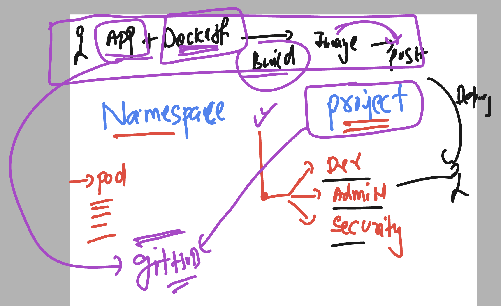

# welcome to final day 

### verify oc login 

```
PS C:\Users\labuser> oc cluster-info
Kubernetes control plane is running at https://api.hm9pf1p6kad6e4221e.eastus.aroapp.io:6443

To further debug and diagnose cluster problems, use 'kubectl cluster-info dump'.
PS C:\Users\labuser> oc get  nodes
NAME                                        STATUS   ROLES                  AGE   VERSION
fiserv-cluster-9dkff-master-0               Ready    control-plane,master   15d   v1.29.10+67d3387
fiserv-cluster-9dkff-master-1               Ready    control-plane,master   15d   v1.29.10+67d3387
fiserv-cluster-9dkff-master-2               Ready    control-plane,master   15d   v1.29.10+67d3387
fiserv-cluster-9dkff-worker-eastus1-rwvz2   Ready    worker                 15d   v1.29.10+67d3387
fiserv-cluster-9dkff-worker-eastus2-rfppk   Ready    worker                 15d   v1.29.10+67d3387
fiserv-cluster-9dkff-worker-eastus3-cnwzm   Ready    worker                 15d   v1.29.10+67d3387
PS C:\Users\labuser>
PS C:\Users\labuser>
PS C:\Users\labuser> oc whoami
kube:admin
PS C:\Users\labuser>

```

## OPenshift project for building container images as well



## creating new-app using oc command 

```
oc new-app  https://github.com/redashu/sample-web-project.git --name ashu-webapp --strategy=docker

===>> output 

--> Found container image a830707 (2 weeks old) from Docker Hub for "nginx"

    * An image stream tag will be created as "nginx:latest" that will track the source image
    * A Docker build using source code from https://github.com/redashu/sample-web-project.git will be created
      * The resulting image will be pushed to image stream tag "ashu-webapp:latest"
      * Every time "nginx:latest" changes a new build will be triggered

--> Creating resources ...
    imagestream.image.openshift.io "nginx" created
    imagestream.image.openshift.io "ashu-webapp" created
    buildconfig.build.openshift.io "ashu-webapp" created
    deployment.apps "ashu-webapp" created
    service "ashu-webapp" created
--> Success
    Build scheduled, use 'oc logs -f buildconfig/ashu-webapp' to track its progress.
    Application is not exposed. You can expose services to the outside world by executing one or more of the commands below:
     'oc expose service/ashu-webapp' 
    Run 'oc status' to view your app.
```

