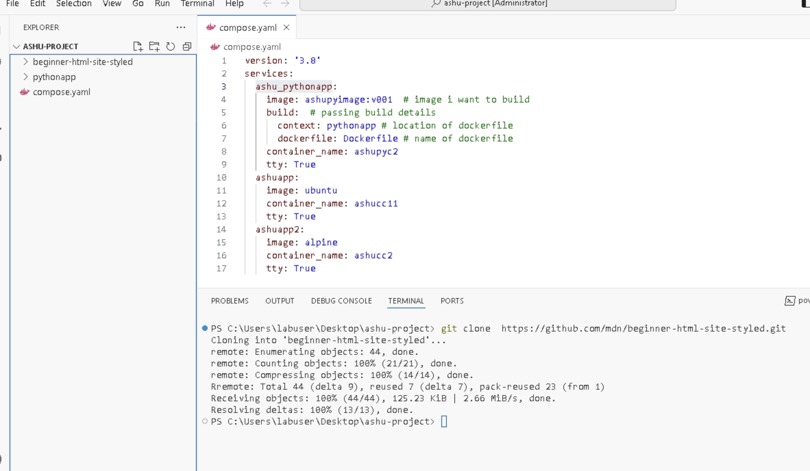

# Revision 

### taking sample webapp code 

### taking Nginx web serv

### building image

### Container networking 

### Creating container and checking default IP 

### POrt forwarding concept 

### implementing port forwarding 

### nginx port forward 

