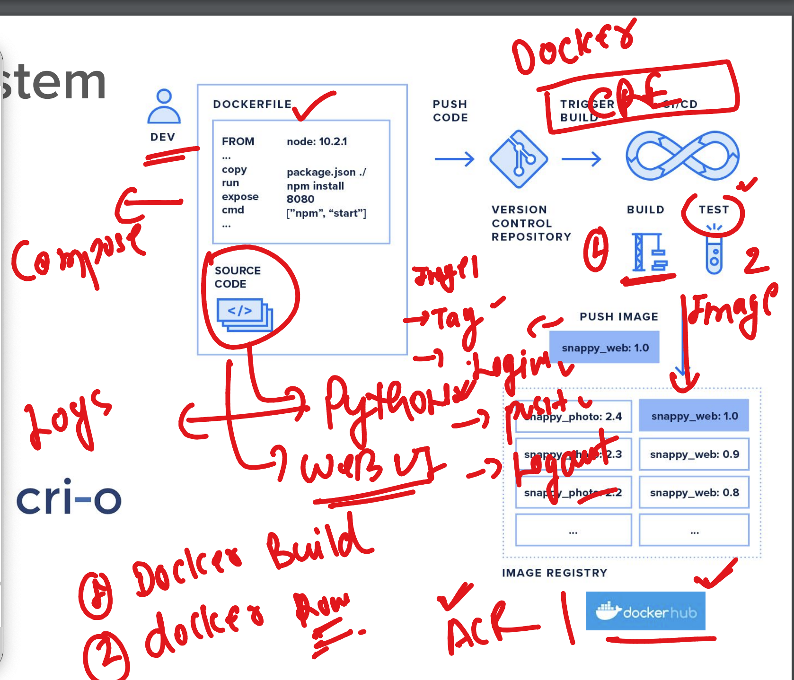
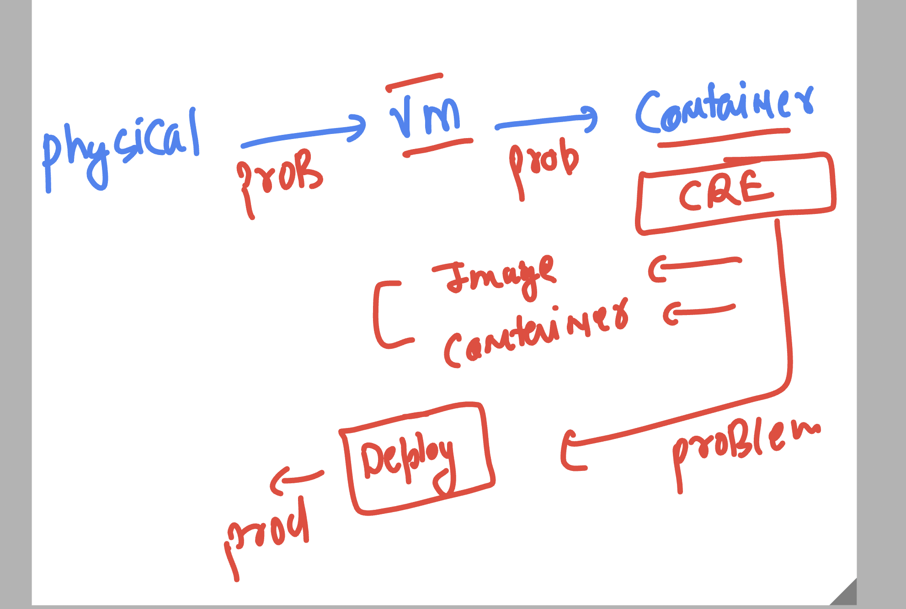
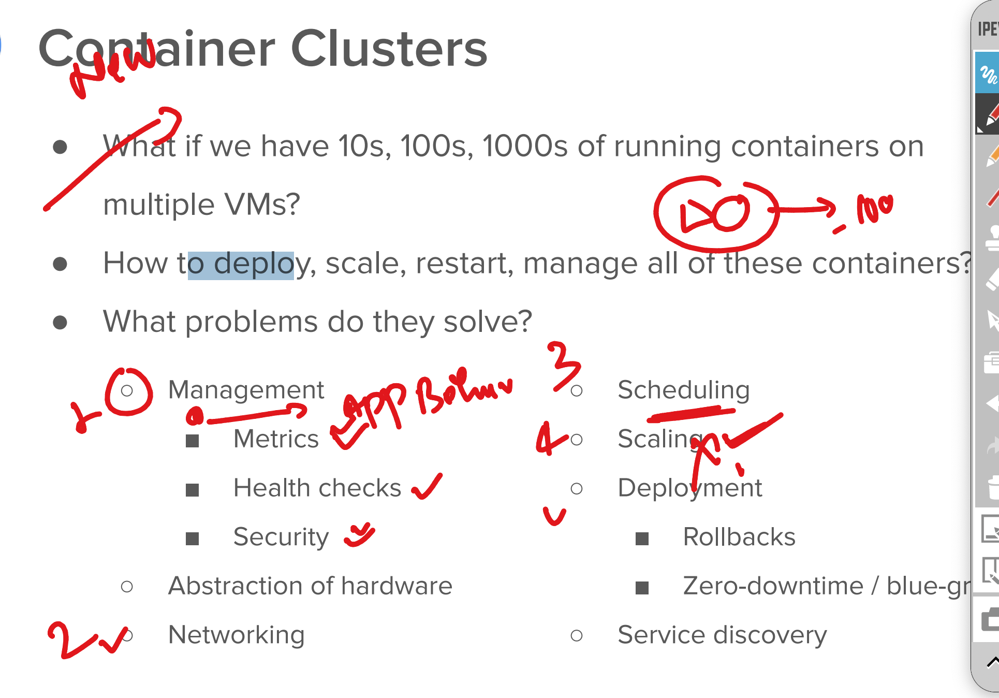
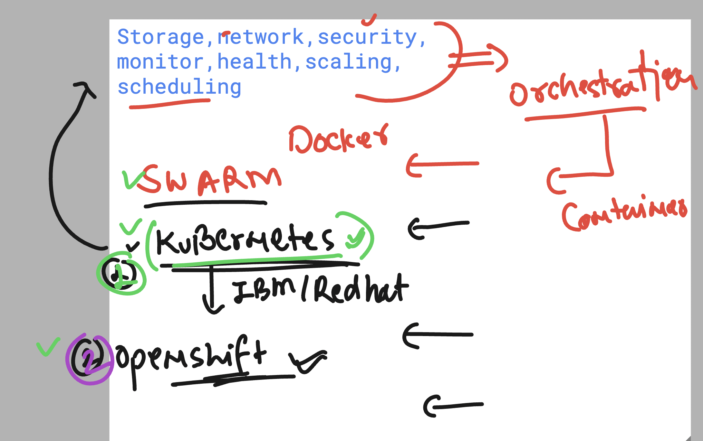
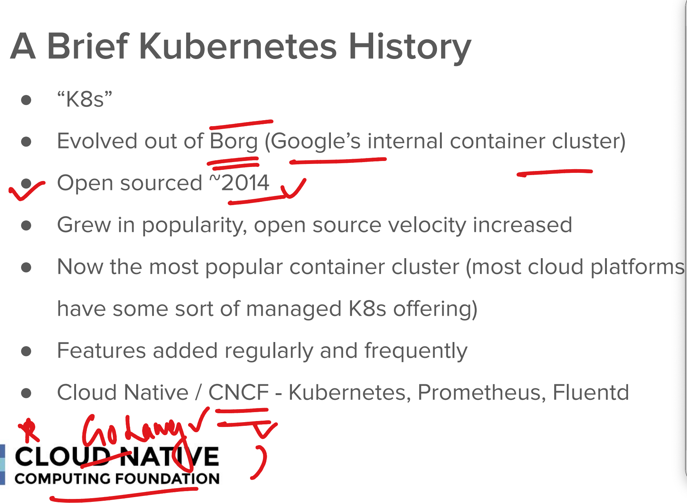
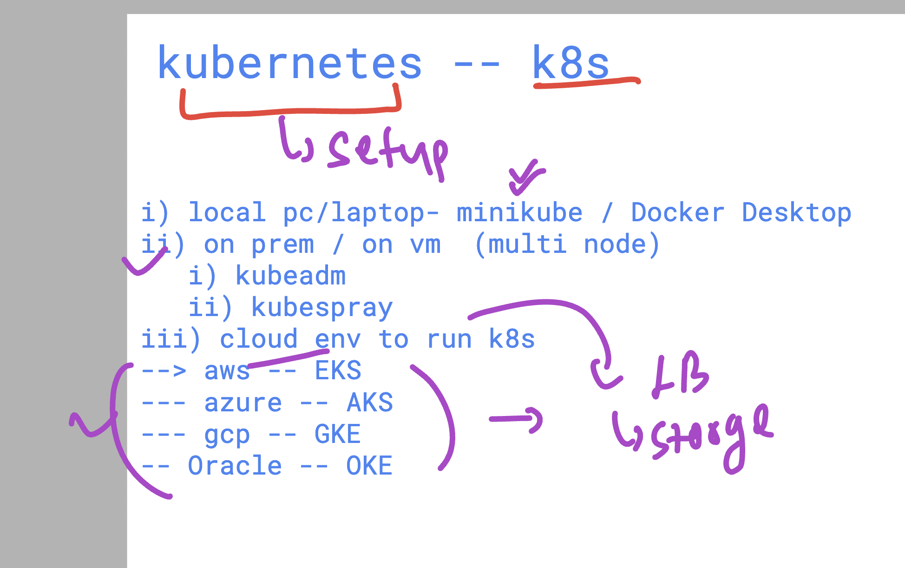
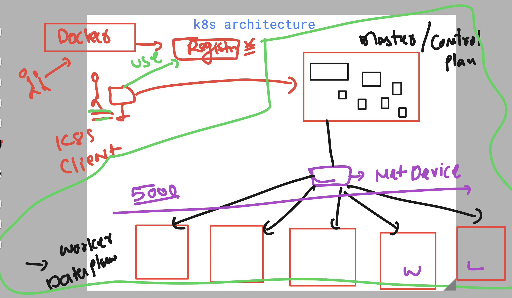
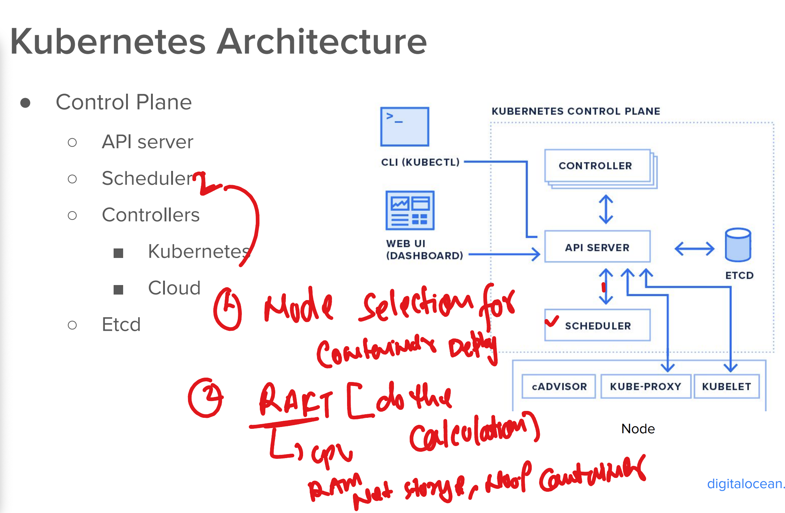
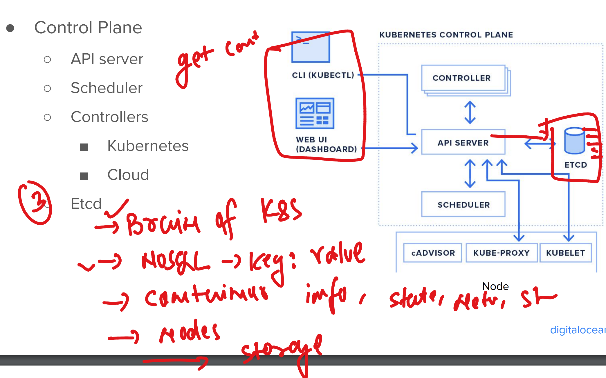

### Container Quick Revision 

### container based app deployment problem 

### Container Cluster problem while deploying app 

### Container ochestration engine to solve these variety of problems

### Info about K8s 

### setup info 

### k8s architecture basic info 

## k8s Control plane Components

### API Server 

### kube-scheduler 

### Etcd 

