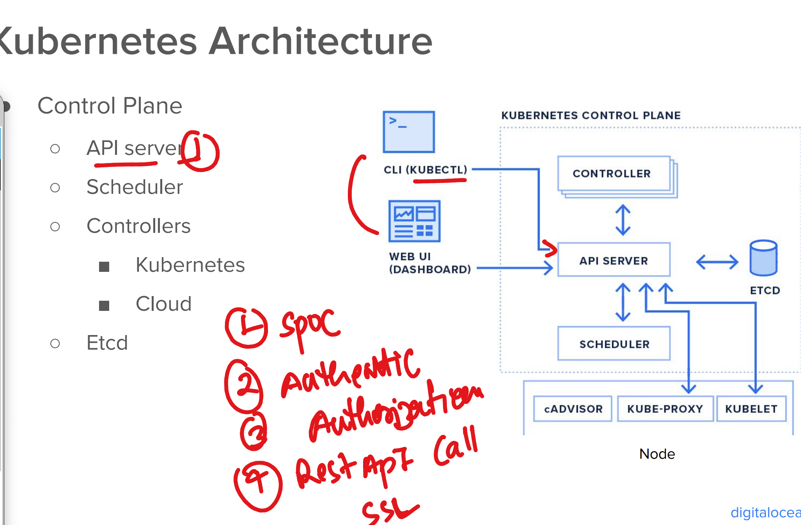

### Container Quick Revision 


### container based app deployment problem 


### Container Cluster problem while deploying app 


### Container ochestration engine to solve these variety of problems


### Info about K8s 


### setup info 


### k8s architecture basic info 


## k8s Control plane Components

### API Server 



### kube-scheduler 


### Etcd 


### from client machine -- checking kubectl version 

```

PS C:\Users\labuser> kubectl  version --client
Client Version: v1.31.4
Kustomize Version: v5.4.2
PS C:\Users\labuser>


```

### checking server version as well

```
PS C:\Users\labuser> kubectl version
Client Version: v1.31.4
Kustomize Version: v5.4.2
Server Version: v1.30.10
PS C:\Users\labuser> kubectl version   -o yaml
clientVersion:
  buildDate: "2024-12-10T11:43:21Z"
  compiler: gc
  gitCommit: a78aa47129b8539636eb86a9d00e31b2720fe06b
  gitTreeState: clean
  gitVersion: v1.31.4
  goVersion: go1.22.9
  major: "1"
  minor: "31"
  platform: windows/amd64
kustomizeVersion: v5.4.2
serverVersion:
  buildDate: "2025-02-24T23:20:36Z"
  compiler: gc
  gitCommit: ccc69071da5040a2bafc1ba9c4775782e0f4e55c
  gitTreeState: clean
  gitVersion: v1.30.10
  goVersion: go1.22.12
  major: "1"
  minor: "30"
  platform: linux/amd64

```

### In client machine in Home directory of user k8s creds are stored

```
PS C:\Users\labuser\.kube> ls


    Directory: C:\Users\labuser\.kube


Mode                 LastWriteTime         Length Name
----                 -------------         ------ ----
d-----        11/28/2024   9:37 AM                cache
-a----          4/4/2025   8:29 AM          15877 config


PS C:\Users\labuser\.kube>


```

## POd info 


