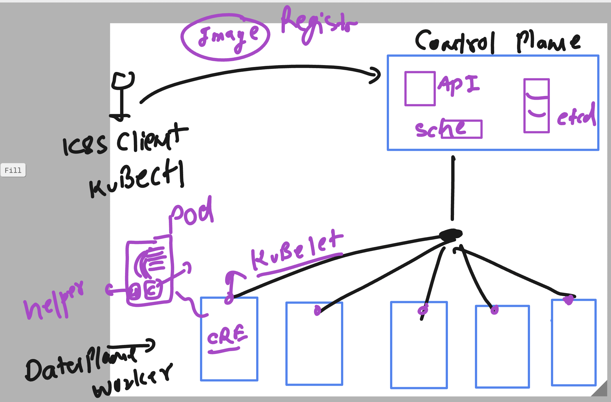
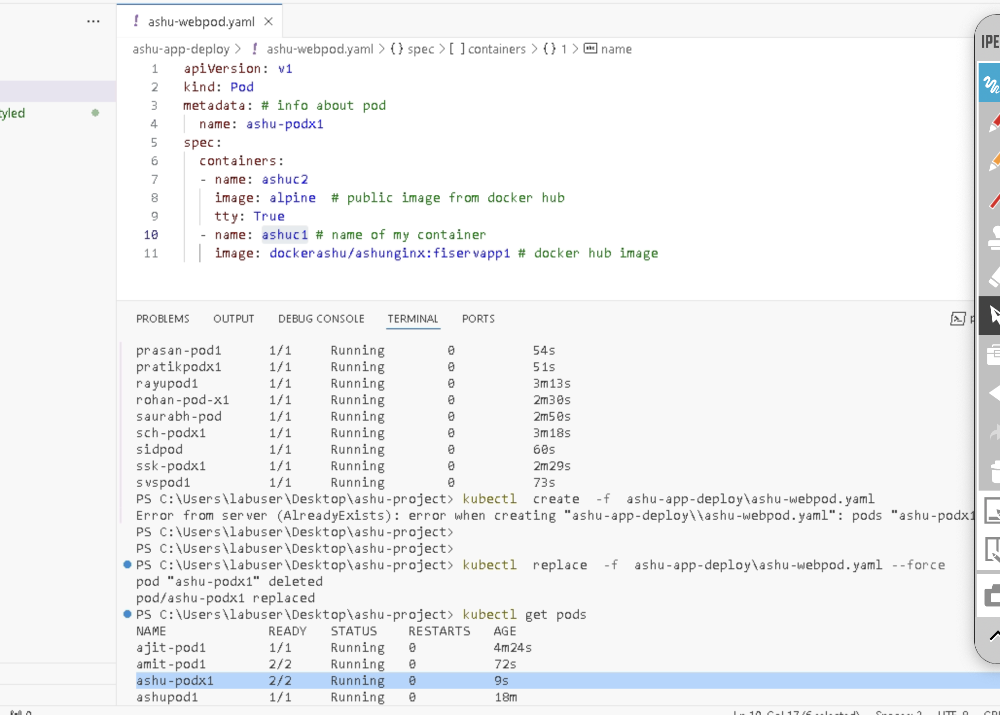
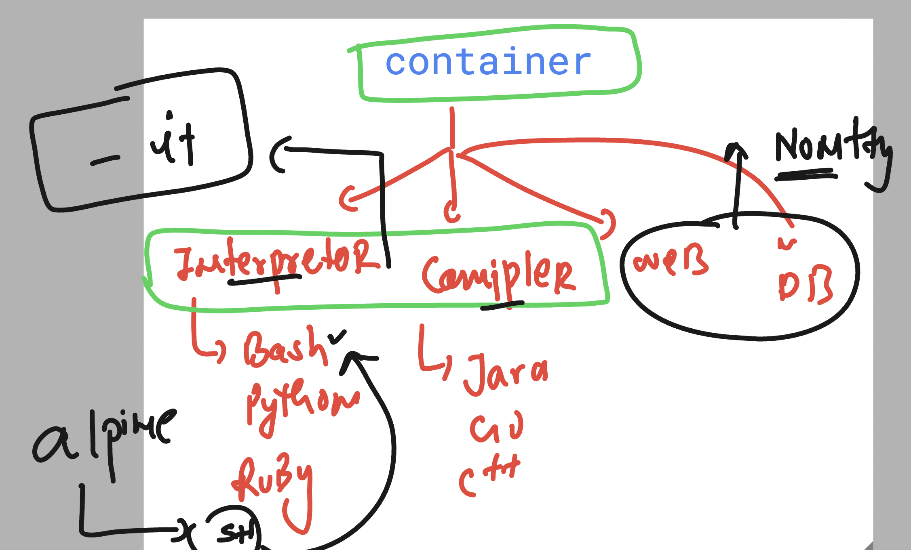

# Revision 



### Creating pod from cli 

```
 kubectl  run  ashupod1  --image dockerashu/ashunginx:fiservapp1
```

### verify pod details on node schedule 

```
PS C:\Users\labuser\Desktop\ashu-project> kubectl get nodes
NAME                                STATUS   ROLES    AGE   VERSION 
aks-agentpool-33643096-vmss000002   Ready    <none>   17m   v1.30.10
aks-usernodes-33643096-vmss00000a   Ready    <none>   17m   v1.30.10
aks-usernodes-33643096-vmss00000b   Ready    <none>   17m   v1.30.10
aks-usernodes-33643096-vmss00000c   Ready    <none>   17m   v1.30.10
aks-usernodes-33643096-vmss00000d   Ready    <none>   17m   v1.30.10
aks-usernodes-33643096-vmss00000e   Ready    <none>   17m   v1.30.10
PS C:\Users\labuser\Desktop\ashu-project>
PS C:\Users\labuser\Desktop\ashu-project> kubectl  get  pods  ashupod1  -o wide
NAME       READY   STATUS    RESTARTS   AGE     IP            NODE                                NOMINATED NODE   READINESS GATES
ashupod1   1/1     Running   0          5m52s   10.244.5.60   aks-agentpool-33643096-vmss000002   <none>           <none>
PS C:\Users\labuser\Desktop\ashu-project>

```

### Some basic kubectl commands 

```
  6 kubectl  run  ashupod1  --image dockerashu/ashunginx:fiservapp1...
   7 kubectl  get  pods
   8 kubectl  get  pods
   9 kubectl get nodes
  10 kubectl  get  pods  ashupod1  -o wide
  11 history
  12 kubectl  get  pods    -o wide
  13 kubectl get nodes
  14 kubectl get nodes  aks-agentpool-33643096-vmss000002  -o wide
  15 kubectl describe  nodes  aks-agentpool-33643096-vmss000002
  16 kubectl get pods -o wide | grep   aks-agentpool-33643096-vmss000002
  17 kubectl  get  pods
  18 kubectl  describe pod  asifpod1
  19 kubectl  delete   pod  asifpod1
  20 kubectl.exe get pods

```

### logs of a POD container 

```
PS C:\Users\labuser\Desktop\ashu-project> kubectl  logs   ashupod1

/docker-entrypoint.sh: /docker-entrypoint.d/ is not empty, will attempt to perform configuration
/docker-entrypoint.sh: Looking for shell scripts in /docker-entrypoint.d/
/docker-entrypoint.sh: Launching /docker-entrypoint.d/10-listen-on-ipv6-by-default.sh
10-listen-on-ipv6-by-default.sh: info: Getting the checksum of /etc/nginx/conf.d/default.conf
10-listen-on-ipv6-by-default.sh: info: Enabled listen on IPv6 in /etc/nginx/conf.d/default.conf
/docker-entrypoint.sh: Sourcing /docker-entrypoint.d/15-local-resolvers.envsh
/docker-entrypoint.sh: Launching /docker-entrypoint.d/20-envsubst-on-templates.sh
/docker-entrypoint.sh: Launching /docker-entrypoint.d/30-tune-worker-processes.sh
/docker-entrypoint.sh: Configuration complete; ready for start up
2025/04/08 12:05:42 [notice] 1#1: using the "epoll" event method
2025/04/08 12:05:42 [notice] 1#1: nginx/1.27.4
2025/04/08 12:05:42 [notice] 1#1: built by gcc 12.2.0 (Debian 12.2.0-14)
2025/04/08 12:05:42 [notice] 1#1: OS: Linux 5.15.0-1084-azure
2025/04/08 12:05:42 [notice] 1#1: getrlimit(RLIMIT_NOFILE): 1048576:1048576
2025/04/08 12:05:42 [notice] 1#1: start worker processes

```

### Sometime we need to login to container for some app troubleshoot 

```
PS C:\Users\labuser\Desktop\ashu-project> kubectl  exec -it    ashupod1 --  /bin/bash 
root@ashupod1:/#
root@ashupod1:/# 
root@ashupod1:/# cd  /usr/share/nginx/html/
root@ashupod1:/usr/share/nginx/html# ls
50x.html  images  index.html  styles 
root@ashupod1:/usr/share/nginx/html# 
root@ashupod1:/usr/share/nginx/html# 
root@ashupod1:/usr/share/nginx/html# exit
exit
PS C:\Users\labuser\Desktop\ashu-project> ^C

```

### Deleting pods 

```
PS C:\Users\labuser\Desktop\ashu-project> kubectl get pod
NAME          READY   STATUS    RESTARTS   AGE
sandhyapod    1/1     Running   0          36m
saravpod1     1/1     Running   0          32m
saurabhpod1   1/1     Running   0          36m
svspod1       1/1     Running   0          36m
PS C:\Users\labuser\Desktop\ashu-project> kubectl delete pod --all
pod "sandhyapod" deleted
pod "saravpod1" deleted
pod "saurabhpod1" deleted
pod "svspod1" deleted
PS C:\Users\labuser\Desktop\ashu-project> kubectl get pod
No resources found in default namespace.
PS C:\Users\labuser\Desktop\ashu-project> 

```

### Getting yaml/json format of pod from running instance 

```
PS C:\Users\labuser\Desktop\ashu-project> kubectl  get  pod  ashupod1
NAME       READY   STATUS    RESTARTS   AGE
ashupod1   1/1     Running   0          20s
PS C:\Users\labuser\Desktop\ashu-project> kubectl  get  pod  ashupod1  -o yaml
apiVersion: v1
kind: Pod
metadata:
  creationTimestamp: "2025-04-08T12:47:53Z"
  labels:
    run: ashupod1
  name: ashupod1
  namespace: default
  resourceVersion: "178715"
  uid: 58eeb9b6-a5d4-4696-9200-2829d730aedf
spec:
  containers:
  - image: dockerashu/ashunginx:fiservapp1
    imagePullPolicy: IfNotPresent
    name: ashupod1
    resources: {}

```

### info about pod details 




```

```

## using tty 



