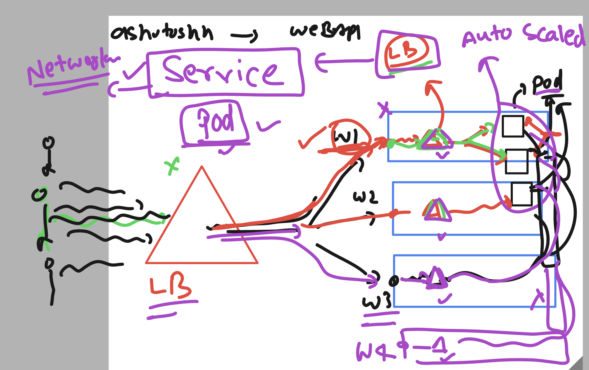

## Container app deployment life cycle 


### Networking in k8s 


## K8s Nodes networking 


### Container networking -- CNM vs CNI 


### K8s create a Default CNI bridge which is gonna use by every kubelet worker node
### give IP address to pod 


## Creating pod yaml using kubectl 

```
 kubectl  run ashuwebpod  --image dockerashu/ashunginx:fiservapp1  --dry-run=client -o yaml

 ```

 ### testing pod to pod connection 

 ```
 PS C:\Users\labuser\Desktop\ashu-project> kubectl.exe  get po -o wide
NAME            READY   STATUS             RESTARTS   AGE     IP             NODE                                NOMINATED NODE   READINESS GATES
amitwebpod      1/1     Running            0          91s     10.244.5.16    aks-agentpool-33643096-vmss000002   <none>           <none>
ashuwebpod      1/1     Running            0          4m10s   10.244.5.12    aks-agentpool-33643096-vmss000002   <none>           <none>
asifwebpod      1/1     Running            0          3m42s   10.244.5.123   aks-agentpool-33643096-vmss000002   <none>           <none>
client-pod      1/1     Running            0          8s      10.244.5.75    aks-agentpool-33643096-vmss000002   <none>           <none>
jhwebpod        1/1     Running            0          3m44s   10.244.5.159   aks-agentpool-33643096-vmss000002   <none>           <none>
krishpod1       1/1     Running            0          16s     10.244.4.87    aks-usernodes-33643096-vmss00000c   <none>           <none>
manojwebpod     1/1     Running            0          4m3s    10.244.5.248   aks-agentpool-33643096-vmss000002   <none>           <none>
pratikwebpod    1/1     Running            0          2m44s   10.244.5.72    aks-agentpool-33643096-vmss000002   <none>           <none>
rayuwebpod      1/1     Running            0          4m1s    10.244.5.224   aks-agentpool-33643096-vmss000002   <none>           <none>
rohanpod        1/1     Running            0          3m45s   10.244.5.235   aks-agentpool-33643096-vmss000002   <none>           <none>
sandhyawebpod   1/1     Running            0          3m45s   10.244.5.124   aks-agentpool-33643096-vmss000002   <none>           <none>
saurabhpod      1/1     Running            0          3m32s   10.244.5.254   aks-agentpool-33643096-vmss000002   <none>           <none>
sidnginxpod     0/1     ImagePullBackOff   0          2m13s   10.244.3.191   aks-usernodes-33643096-vmss00000e   <none>           <none>
sskwebpod       1/1     Running            0          3m30s   10.244.4.55    aks-usernodes-33643096-vmss00000c   <none>           <none>
svswebpod       1/1     Running            0          78s     10.244.5.99    aks-agentpool-33643096-vmss000002   <none>           <none>


PS C:\Users\labuser\Desktop\ashu-project> kubectl.exe  exec -it  client-pod -- /bin/sh 
/ # ping  10.244.5.16
PING 10.244.5.16 (10.244.5.16): 56 data bytes        
64 bytes from 10.244.5.16: seq=0 ttl=63 time=0.192 ms
64 bytes from 10.244.5.16: seq=1 ttl=63 time=0.135 ms
64 bytes from 10.244.5.16: seq=2 ttl=63 time=0.136 ms
^C
--- 10.244.5.16 ping statistics ---
3 packets transmitted, 3 packets received, 0% packet loss
round-trip min/avg/max = 0.135/0.154/0.192 ms
/ #

```

## k8s client machine can connect to pod webapp using proxy 

```
PS C:\Users\labuser\Desktop\ashu-project> kubectl port-forward  pod/ashuwebpod  1234:80 
Forwarding from 127.0.0.1:1234 -> 80
Forwarding from [::1]:1234 -> 80
Handling connection for 1234
Handling connection for 1234

```


## Intro to service in k8s 



### type of service in k8s 


### creating service methods 


### creating clusterIP type service 

```
 kubectl  expose  pod  ashuwebpod  --type ClusterIP --port 80 --name  ashulb1  --dry-run=client -o yaml
====>

PS C:\Users\labuser\Desktop\ashu-project> kubectl create -f .\ashu-app-deploy\clusterip_svc.yaml
service/ashulb1 created
PS C:\Users\labuser\Desktop\ashu-project> kubectl.exe  get  service 
NAME         TYPE        CLUSTER-IP    EXTERNAL-IP   PORT(S)   AGE
ashulb1      ClusterIP   10.0.97.54    <none>        80/TCP    7s
asiflb1      ClusterIP   10.0.175.85   <none>        80/TCP    51s
kubernetes   ClusterIP   10.0.0.1      <none>        443/TCP   2d
```