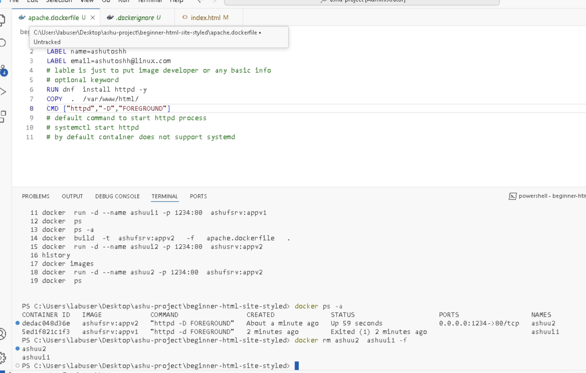
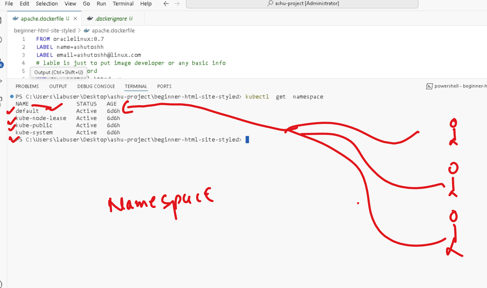
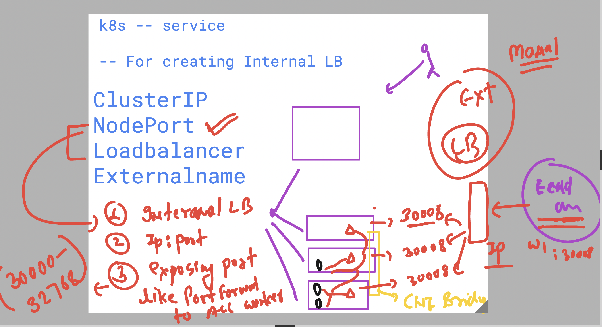
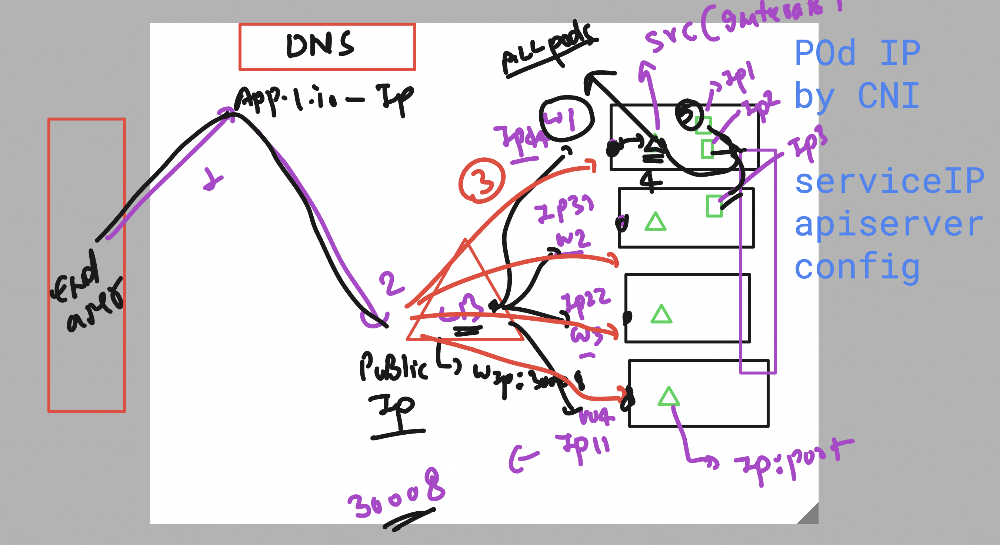
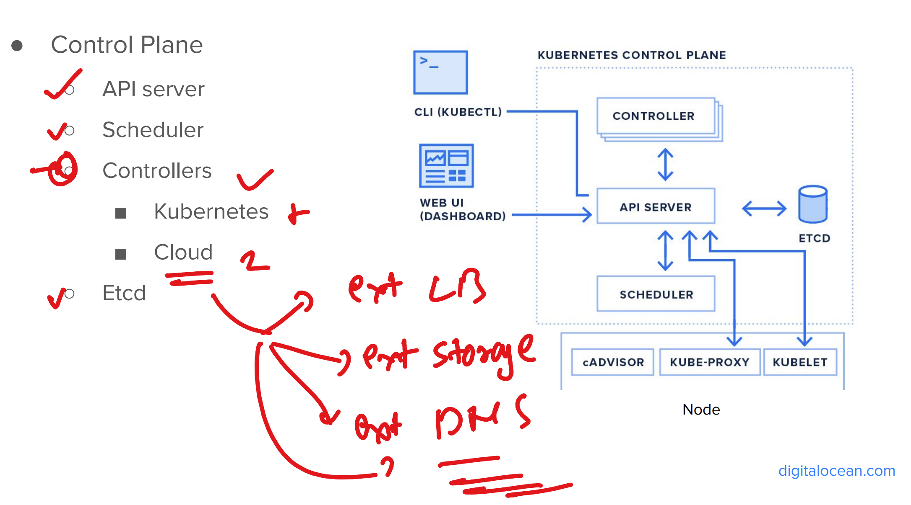

# Dockerfile for apache httpd setup

```Dockerfile

FROM oraclelinux:8.7 
LABEL name=ashutoshh
LABEL email=ashutoshh@linux.com 
# lable is just to put image developer or any basic info 
# optional keyword 
RUN dnf  install httpd -y 
COPY  .  /var/www/html/
CMD ["httpd","-d","FOREGROUND"]
# default command to start httpd process
# systemctl start httpd 
# by default container does not support systemd
```

### Building image using custom dockerfile 

```
PS C:\Users\labuser\Desktop\ashu-project\beginner-html-site-styled> ls


    Directory: C:\Users\labuser\Desktop\ashu-project\beginner-html-site-styled


Mode                 LastWriteTime         Length Name
----                 -------------         ------ ----
d-----          4/4/2025  12:16 PM                images
d-----          4/4/2025  12:16 PM                styles
-a----         4/10/2025  11:50 AM             46 .dockerignore
-a----         4/10/2025  11:51 AM            360 apache.dockerfile
-a----          4/4/2025  12:16 PM            704 CODE_OF_CONDUCT.md
-a----          4/4/2025   1:30 PM            152 Dockerfile
-a----         4/10/2025  11:53 AM           1128 index.html
-a----          4/4/2025  12:16 PM           6671 LICENSE
-a----          4/4/2025  12:16 PM            472 README.md


PS C:\Users\labuser\Desktop\ashu-project\beginner-html-site-styled> docker  build  -t  ashufsrv:appv1   -f   apache.dockerfile   .


```

### Overall summary of container image 



## namespace in k8s 

- A private space for particular user to keep their resource 



### Creating and setting namespace 

```
kubectl  create   namespace  ashu-project 

===>
PS C:\Users\labuser\Desktop\ashu-project\beginner-html-site-styled> kubectl  get  ns        
NAME              STATUS   AGE
ashu-project      Active   7s
default           Active   6d6h
kube-node-lease   Active   6d6h
kube-public       Active   6d6h
kube-system       Active   6d6h

===>
 kubectl  config set-context --current --namespace  ashu-project 
Context "fiserv-cluster1" modified.
PS C:\Users\labuser\Desktop\ashu-project\beginner-html-site-styled> 

```

### Creating pod in custom namespace 

```
 61 kubectl run ashupodx1 --image docker.io/dockerashu/ashufsrv:appv2 --dry-run=client -oyaml
  62 kubectl run ashupodx1 --image docker.io/dockerashu/ashufsrv:appv2 --dry-run=client -oyaml  >newpod.yaml


PS C:\Users\labuser\Desktop\ashu-project\ashu-app-deploy> kubectl create -f .\newpod.yaml
pod/ashupodx1 created
PS C:\Users\labuser\Desktop\ashu-project\ashu-app-deploy> kubectl get  pods
NAME        READY   STATUS              RESTARTS   AGE
ashupodx1   0/1     ContainerCreating   0          5s
PS C:\Users\labuser\Desktop\ashu-project\ashu-app-deploy>

```

### NodePOrt service Explanation 



### service 



### Controller in k8s 



### Creating Nodeport 

```
PS C:\Users\labuser\Desktop\ashu-project\ashu-app-deploy> kubectl get  po
NAME        READY   STATUS    RESTARTS   AGE
ashupodx1   1/1     Running   0          33m
PS C:\Users\labuser\Desktop\ashu-project\ashu-app-deploy>
PS C:\Users\labuser\Desktop\ashu-project\ashu-app-deploy> kubectl expose pod ashupodx1  --type NodePort --port 80 --name ashulb1 --dry-run=client -oyaml >np.yaml 
PS C:\Users\labuser\Desktop\ashu-project\ashu-app-deploy> kubectl.exe create -f np.yaml 
service/ashulb1 created
PS C:\Users\labuser\Desktop\ashu-project\ashu-app-deploy> kubectl get svc 
NAME      TYPE       CLUSTER-IP     EXTERNAL-IP   PORT(S)        AGE
ashulb1   NodePort   10.0.126.163   <none>        80:30723/TCP   4s 
PS C:\Users\labuser\Desktop\ashu-project\ashu-app-deploy> kubectl get po -o wide
NAME        READY   STATUS    RESTARTS   AGE   IP             NODE                                NOMINATED NODE   READINESS GATES
ashupodx1   1/1     Running   0          34m   10.244.5.111   aks-agentpool-33643096-vmss000002   <none>           <none>
PS C:\Users\labuser\Desktop\ashu-project\ashu-app-deploy>
PS C:\Users\labuser\Desktop\ashu-project\ashu-app-deploy> 
PS C:\Users\labuser\Desktop\ashu-project\ashu-app-deploy> kubectl  get  endpoints 
NAME      ENDPOINTS         AGE  
ashulb1   10.244.5.111:80   3m54s
PS C:\Users\labuser\Desktop\ashu-project\ashu-app-deploy> 


```
