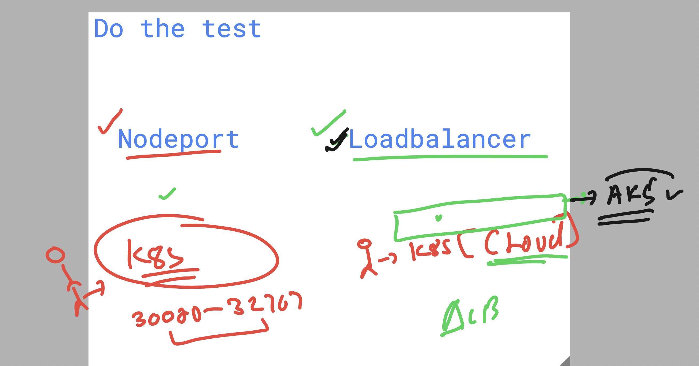
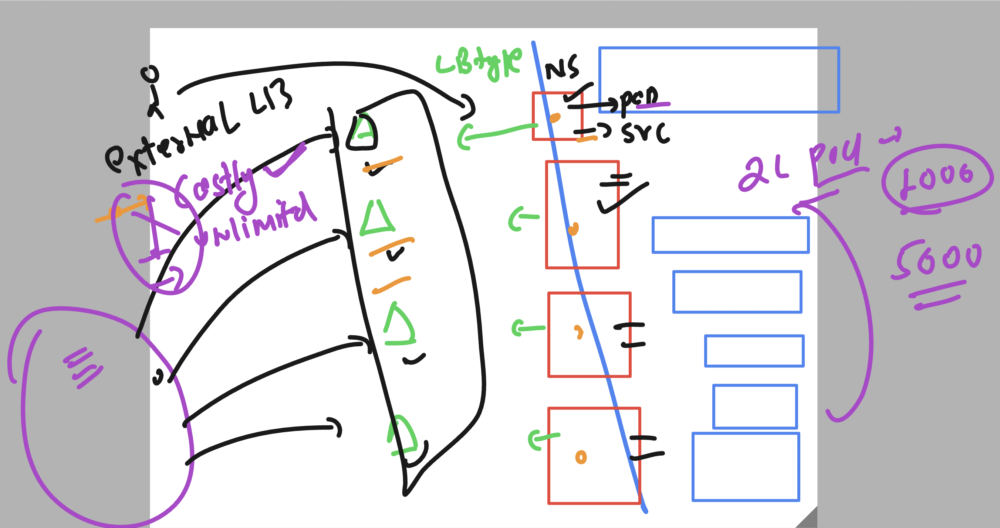
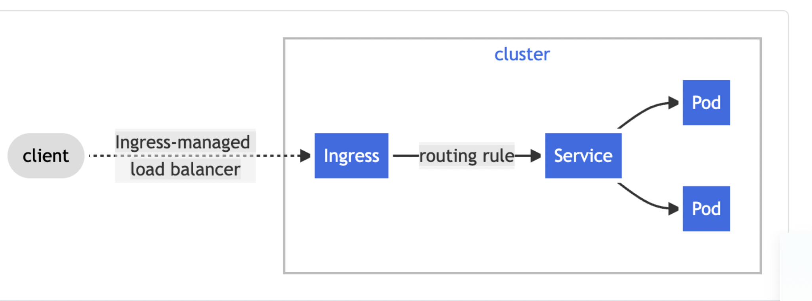
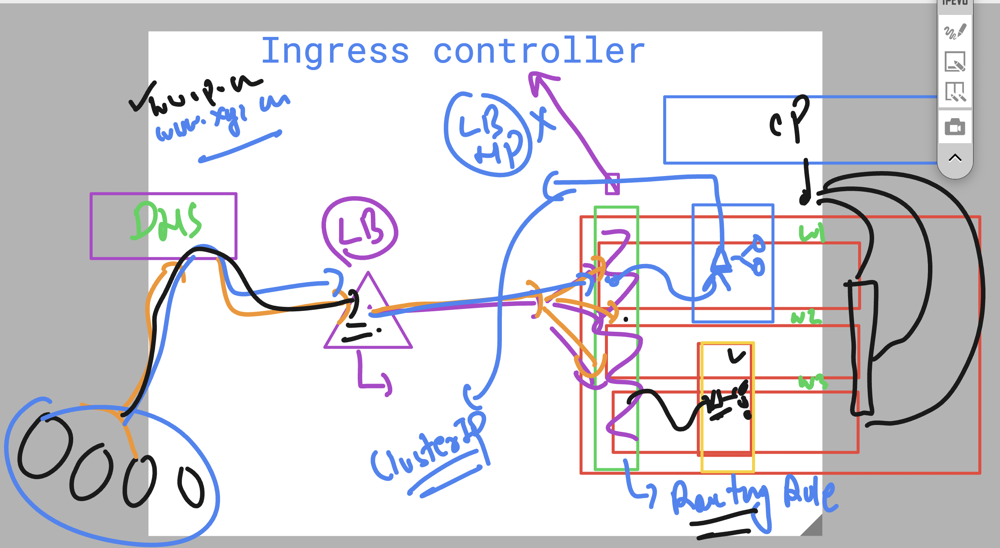
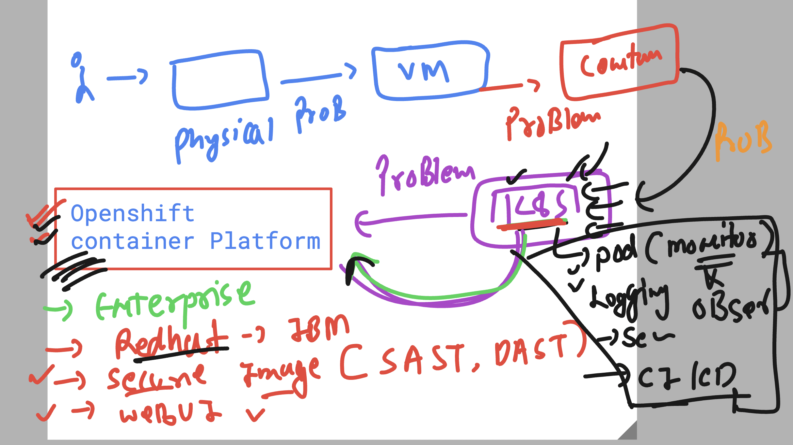

### checking k8s details 

```
PS C:\Users\labuser\Desktop\ashu-project> kubectl  get nodes
NAME                                STATUS   ROLES    AGE     VERSION 
aks-agentpool-33643096-vmss000002   Ready    <none>   2d23h   v1.30.10
aks-usernodes-33643096-vmss00000a   Ready    <none>   2d23h   v1.30.10
aks-usernodes-33643096-vmss00000b   Ready    <none>   2d23h   v1.30.10
aks-usernodes-33643096-vmss00000c   Ready    <none>   2d23h   v1.30.10
aks-usernodes-33643096-vmss00000d   Ready    <none>   2d23h   v1.30.10
aks-usernodes-33643096-vmss00000e   Ready    <none>   2d23h   v1.30.10
PS C:\Users\labuser\Desktop\ashu-project> 
PS C:\Users\labuser\Desktop\ashu-project> kubectl.exe  config  get-contexts 
CURRENT   NAME                                                         CLUSTER                                   AUTHINFO                                             NAMESPACE
          default/api-cluster-synergificsoftware-com:6443/kube:admin   api-cluster-synergificsoftware-com:6443   kube:admin/api-cluster-synergificsoftware-com:6443   default
          docker-desktop                                               docker-desktop                            docker-desktop                                          
*         fiserv-cluster1                                              fiserv-cluster1                           clusterUser_fiserv-aks_fiserv-cluster1               ashu-project
PS C:\Users\labuser\Desktop\ashu-project> kubectl.exe  get  pod,svc
No resources found in ashu-project namespace.
PS C:\Users\labuser\Desktop\ashu-project> 

```

### NodePort vs Loadbalancer service 



### Creating Loadbalancer service using Pod Expose type 
- ONly cloud controlled k8s can use LB service type 
- k8s is having cloud controller running in control plane 

```
PS C:\Users\labuser\Desktop\ashu-project\ashu-app-deploy> kubectl  create -f .\newpod.yaml
pod/ashupodx1 created
PS C:\Users\labuser\Desktop\ashu-project\ashu-app-deploy> kubectl.exe  get  pods
NAME        READY   STATUS    RESTARTS   AGE
ashupodx1   1/1     Running   0          5s
PS C:\Users\labuser\Desktop\ashu-project\ashu-app-deploy> kubectl  expose pod ashupodx1  --type LoadBalancer --port 80 --name ashulb1  

service/ashulb1 exposed                                                                                                                                               NAM
PS C:\Users\labuser\Desktop\ashu-project\ashu-app-deploy> kubectl.exe  get  service
NAME      TYPE           CLUSTER-IP    EXTERNAL-IP   PORT(S)        AGE                                                                -synergificsoftware-com:6443   def
ashulb1   LoadBalancer   10.0.42.133   <pending>     80:31492/TCP   5s 
PS C:\Users\labuser\Desktop\ashu-project\ashu-app-deploy>                                                                                                                
PS C:\Users\labuser\Desktop\ashu-project\ashu-app-deploy> kubectl.exe  get  ep                                                         _fiserv-cluster1               ash
NAME      ENDPOINTS        AGE
ashulb1   10.244.5.98:80   30s
PS C:\Users\labuser\Desktop\ashu-project\ashu-app-deploy> 

```

### Problem with Multiple External Loadbalancer type service 



### Ingress controller 



### Ingress new 



### Introduction to OCP by Redhat (IBM)




