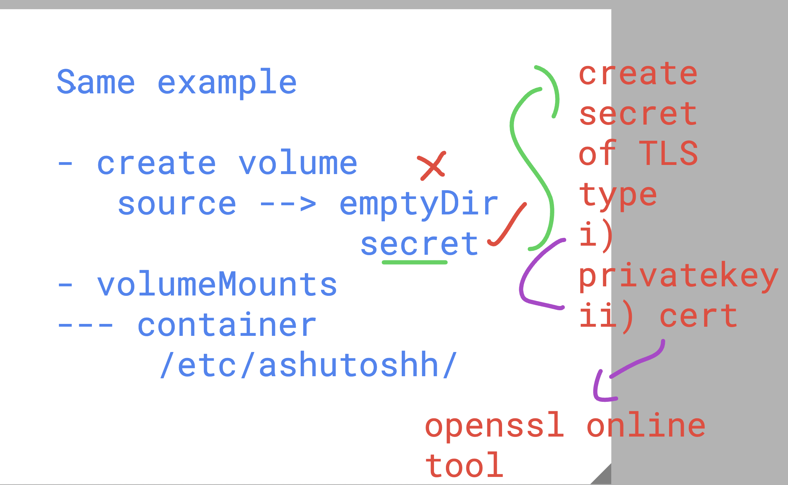

## create pod with following features 

<details><summary>show</summary>
<p>
```bash
1. create  pod using deployment in openshift 
2. do manual scaling 
3. create service of nodeport type and check EP details 
4. use same docker image which you have used in your k8s 
5. make sure you are doing in your custom project  yourname-fiserv

```
</p>
</details>

## Creating storage using secret and mount insid pod 




